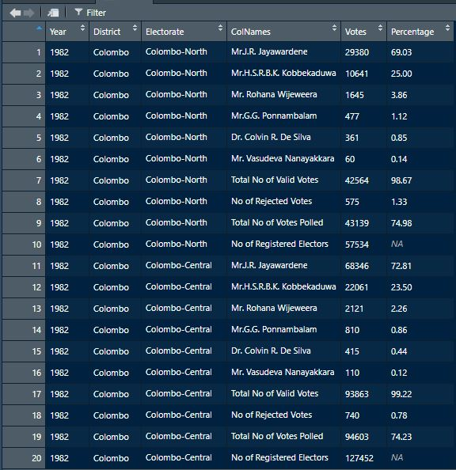

Presidential Election Data
================

My motivation to spend time on this project is that no one has done it
yet and also it would be useful for the presidential election which will
happen before the end of year 2019.

# Process of Harvesting Presidential Election data.

This is a six step process. Each step is crucial and necessary, also
explained thoroughly using directories and markdown files.

The steps are

  - Step 1 - Find Data.
  - Step 2 - Extract Data.
  - Step 3 - Validate Data.
  - Step 4 - Clean the Data.
  - Step 5 - Develop CSV files.
  - Step 6 - Develop final Data-frame and CSV file.

## Step 1 : Find Data

Sri Lanka does have an open gov data [website](http://www.data.gov.lk)
but there is no data for the topic in concern. The topic in concern is
how people have voted in the presidential elections so far(from 1982
until mid 2019), Seven Presidential elections. Thankfully the data that
I need was in the Elections Commission
[website](https://elections.gov.lk/web/en/elections/elections-results/presidential-elections-results/).

Unfortunately the data is not in csv, excel, text or any other usable
format. There are seven pdf files which has the data I desire. This data
is much more accurate and official is what I expected. Yet there were
some disappointments.

## Step 2 : Extract Data

Extracting data from these seven files is my only way of forming a
meaningful data-frame. This is called pdf scraping. I started this
process from year 2015 but down the years it became very difficult. The
main reason for this could be that we did not have advanced
technological tools such as computers or spread sheets. With some hustle
and creative thinking I was able to do the data extraction successfully
I might add.

The folders Year1982, Year1988, Year1994, Year1999, Year2005, Year2005,
Year2010 and Year2015 include clear information regarding the data
extraction process. Each folder has the pdf file that data needs to be
extracted, R script used for data extraction, a markdown file explaining
the data extraction and validation, and finally, few figures showing
anomalies occur in the pdf file which needs to be rectified.

The process is clearly explained to each year separately in each folder,
with precise instructions and explanations. It should be noted that this
is the only time extract the data. But in perspective of resolving
misprints or miscalculations in the pdf file there will be few
coordinated attempts but successful.

## Step 3 : Validate the Data

The first attempt will occur with data extraction. Mainly Sri Lanka has
160 electorates which are divided into 22 districts. The pdf files
follow the format of summarizing the Final district results after
mentioning their respective electorates. This gives us the opportunity
to compare the district(22 districts) tallying and electorate
tallying(160) for Registered Electors, Polled Votes, Valid Votes,
Rejected Votes and Candidates votes.

Some occasions this tallying does not produce same values for collection
of all districts and electorates, which means there might me a printing
error or a miscalculation. This is rectified at the first level.

## Step 4 : Clean the Data

After the rectification it is necessary to clean the data. This process
is explained in the ExtractedData directory with a markdown file. Work
here includes setting variable types for columns and rectifying further.

Which includes the issue of maintaining unity in districts and
electorates names, spellings and case sensitiveness throughout the seven
presidential elections. Also other information such as Registered
Electors, Valid Votes, Polled Votes and Rejected Votes should contain
same variable names throughout the seven presidential elections.

Finally check if percentages are in their domain, which is in between 0
and 100. Further, check if there are missing values and if so take
necessary action. After resolving this we have a clear individual
data-frame for each election. It should be noted that there are three
markdown files for three types of table formats from the pdf files.
These table formats focus on the votes and percentage values given.

## Step 5 : Develop CSV files

After much tiresome work of data extraction and cleaning now we have
clean individual data-frames. They can be produced as CSV files for each
presidential election.

## Step 6 : Develop final Data-frame and CSV file

While we do have 7 files it would be wiser to combine them and produce
one final data-frame. This also can be done by R functions and is done
in the directory Final Data with the instructions included in a markdown
file. The Final data-frame is named as Final.csv in the directory.

# Suggestions To Make Election Data collection Easier

1.  Summary results should be included in the pdf reports as pre 2010
    election files.
2.  Should develop a software which will make election data collection
    easier.
3.  This software should have tests to ensure that values or
    calculations are possible values in their respective domains.

For Example to Votes :

  - Total Polled = Total Valid + Total Rejected

and

  - Total Valid = Votes casted to Candidate A + Votes casted to
    Candidate …

Also for Percentages are generated by below equations for the below vote
values :

  - Total Polled % = (Total Polled/ Total Registered) \* 100
  - Total Valid % = (Total Valid/ Total Polled) \* 100
  - Total Rejected % = (Total Rejected/ Total Polled) \* 100
  - Candidate A % = (Candidate A/ Total Polled ) \*100

Below is a image of a sample extract table for an electorate and we can
clearly see the percentages are in order as mentioned above.

4.  Not only pdf files we should be able to provide usable data files
    such as csv or excel or text.

# Future Plans for the Data

Most coolest and useful thing to do with this data-frame is to develop
an Rshiny app which can

1.  Provide functions to download data with specific interests.

<!-- end list -->

  - Electorate data throughout all the elections.
  - District data throughout all the elections.
  - Complete data frame for all the seven years.
  - Data-frame for a specific year.

<!-- end list -->

2.  Provide data visualizations under meaningful themes as 2 dimensional
    or 3 dimensional plots.

# Future Similar Projects based on pdf scraping

1.  Sri Lanka has parliament elections since 1947, they also can be
    extracted.

2.  Provincial Council Election results from 1999 until now can be
    extracted.

3.  Local Authorities Election results from 2002 until now can be
    extracted.

It took me 3 weeks to complete this project to its entirety and I feel
very successful and confident that it would be useful.

*THANK YOU*
