```{r setup, include=FALSE}
knitr::opts_chunk$set(echo = TRUE,warning = FALSE)

# Load the packages
library(data.table)
library(stringr)
library(splitstackshape)
library(pdftools)
```

# Structure of Document

Data extraction begins from page four of the document. Each page from here has a 
table representing  each district. All tables follow the similar format. 

If we consider the columns, first column is for candidate names with other counts,
second column and its consecutive columns are for electorates. Final two columns
are Postal Votes and Final District Results. 

Each cell has two numeric values which are number of votes and percentages, this is 
true except for the last row. First 3 rows are for candidates names, followed by 
No of Valid Votes, No of Rejected Votes, Total No of Votes Polled and 
finally Total No of Registered Electors but mistakenly written as No of Rejected Electors.

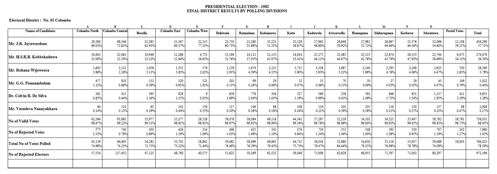

# Process of Extraction

Each table has been extracted separately without any issues. Two inputs are 
used, one is page number and other is for special cases of several districts. 
Two functions were created to extract two types of tables, yet both of them
look similar except a few anomalies.

```{r Election 1988}
# load the pdf file
SL_PE_1982<-pdf_text("PresidentialElections1982.pdf")

# source the function
source("Extract1982.R")

# creating initial dataset Election1994
Election1982<-NULL

# special pages which has the same format 
pages<-c(8:9,11,14:17,19,23,25)

for (i in pages) 
{
    Election1982[[i]]<-Extract_Table1982(i)    
}
# Extracting data for Colombo District
    Election1982[[4]]<-Extract_Table1982(4,Colo=TRUE)    
# Extracting data for Mahanuwara District
    Election1982[[7]]<-Extract_Table1982(7,Maha=TRUE)
# Extracting data for Galle District   
    Election1982[[10]]<-Extract_Table1982(10,Ga=TRUE)
# Extracting data for Kurunegala District    
    Election1982[[18]]<-Extract_Table1982(18,Kur=TRUE)    
# Extracting data for Kegalle District    
    Election1982[[24]]<-Extract_Table1982(24,Keg = TRUE)        
# Extracting data for Gampaha District
    Election1982[[5]]<-Extract_Table2_1982(5,Gam=TRUE)
# Extracting data for Kalutara District    
    Election1982[[6]]<-Extract_Table2_1982(6)
# Extracting data for Hambantota District
    Election1982[[12]]<-Extract_Table2_1982(12,HP=TRUE)
# Extracting data for Polonnaruwa District    
    Election1982[[21]]<-Extract_Table2_1982(21,HP=TRUE)
# Extracting data for Jaffna District    
    Election1982[[13]]<-Extract_Table2_1982(13,Jaf=TRUE)    
# Extracting data for Anuradhapura District    
    Election1982[[20]]<-Extract_Table2_1982(20,Anu = TRUE)        
# Extracting data for Badulla District    
    Election1982[[22]]<-Extract_Table2_1982(22,Bad = TRUE)        
        
# final data set
Election1982<-do.call("rbind",Election1982)
```

# Validating Data Extracted

There is a summary for election results yet both way tallying
is compared between the extracted data. Also both way tallying is
used to clarify the summary as well. Both Way Tallying means summation of 
all district final results is equal to summation of all electorates final results.

## Checking for Registered Electors.

It should have been 8117015(still miscalculated) but mistakenly 
written as 8145015.

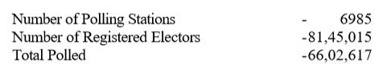

```{r Reg Electors}
# Extracting only Final District Results of 
# Number of Registered Electors
# and then adding all the votes 
ElecFinal1982<-subset(Election1982,Electorate=="Total" 
                      & ColNames=="No of Registered Electors")
# added votes will be cross checked with the pdf document
ElecFinal1982[,sum(Votes,na.rm = TRUE),by="ColNames"]

# Extracting except Final District Results of 
# Number of Registered Electors
# and then adding all the votes 
ElecFinal1982<-subset(Election1982,Electorate!="Total" 
                      & ColNames=="No of Registered Electors")
# added votes will be cross checked with the pdf document
ElecFinal1982[,sum(Votes,na.rm = TRUE),by="ColNames"]
```

8116992 is more accurate than 8117025. Because the values are directly from
the electorates than the tallied district tables. Exactly 33 extra votes are 
added because of miscalculation. 

### Colombo District

The tallied table has 5 extra votes.

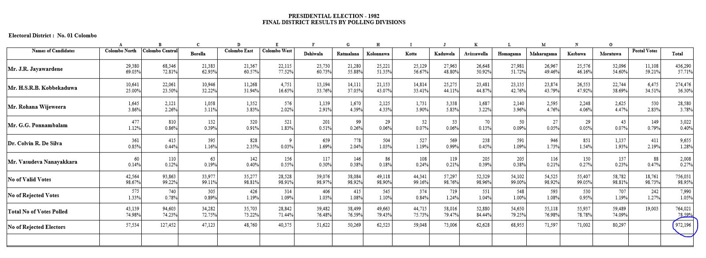

```{r Reg Elec Validating Colombo }
ElecFinal1982<-subset(Election1982, District=="Colombo" & Electorate !="Total"
                      & ColNames=="No of Registered Electors")

ElecFinal1982[,sum(Votes,na.rm = TRUE),by="ColNames"]
```

### Matale District

The tallied table has 10 extra votes. 

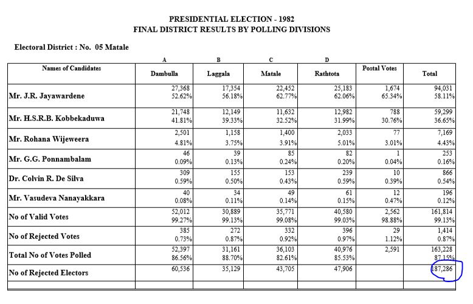

```{r Reg Elec Validating Matale }
ElecFinal1982<-subset(Election1982, District=="Matale" & Electorate !="Total"
                      & ColNames=="No of Registered Electors")

ElecFinal1982[,sum(Votes,na.rm = TRUE),by="ColNames"]
```

### Monaragala District

The tallied table has 18 extra votes.

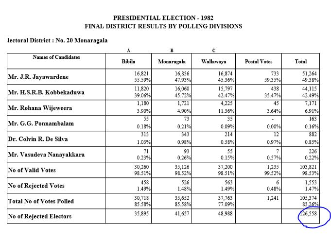

```{r Reg Elec Validating Monaragala}
ElecFinal1982<-subset(Election1982, District=="Monaragala" & Electorate !="Total"
                      & ColNames=="No of Registered Electors")

ElecFinal1982[,sum(Votes,na.rm = TRUE),by="ColNames"]
```

So 33 votes extra in the tallied vote count. 
Final Count for No of Registered Electors is 8116992.

## Checking for Total Polled 

Exactly 10000 votes extra in the tallied district table which
leads to the misprint.


```{r Total Polled}
# Extracting only Final District Results of 
# Total Polled
# and then adding all the votes 
ElecFinal1982<-subset(Election1982,Electorate=="Total" 
                      & ColNames=="Total No of Votes Polled")
# added votes will be cross checked with the pdf document
ElecFinal1982[,sum(Votes,na.rm = TRUE),by="ColNames"]

# Extracting except Final District Results of 
# Total Polled
# and then adding all the votes 
ElecFinal1982<-subset(Election1982,Electorate!="Total" 
                      & ColNames=="Total No of Votes Polled")
# added votes will be cross checked with the pdf document
ElecFinal1982[,sum(Votes,na.rm = TRUE),by="ColNames"]
```

### Nuwara-Eliya District

Extra 10000 votes are from miscalculation of the Nuwara-Eliya district.
So the final value for Total No of Votes Polled is 6592617.

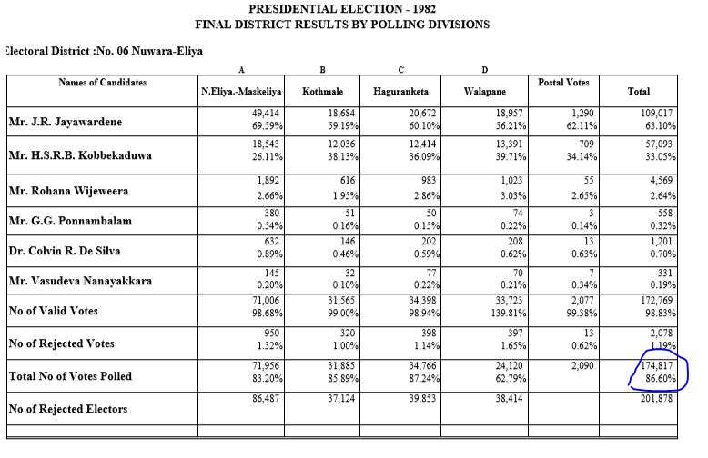

```{r Total Polled Nuwara-Eliya District}
ElecFinal1982<-subset(Election1982, District=="Nuwara-Eliya" & Electorate !="Total"
                      & ColNames=="Total No of Votes Polled")

ElecFinal1982[,sum(Votes,na.rm = TRUE),by="ColNames"]
```

## Checking for Rejected Votes

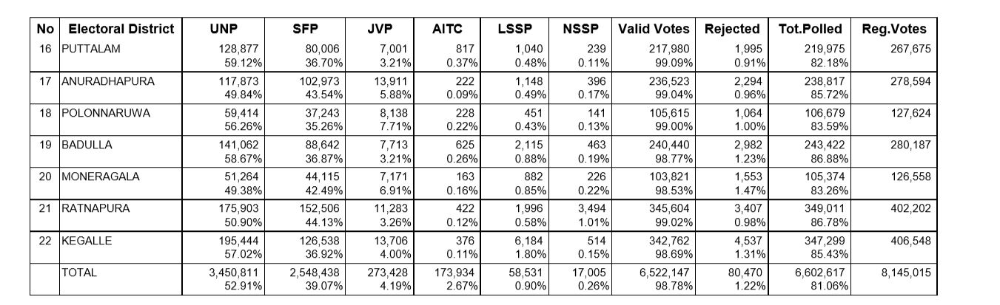

The value for rejected votes is not true here because the value for Nuwara-Eliya
district is wrong in this district tallied table. Which means 30 votes are not
added properly

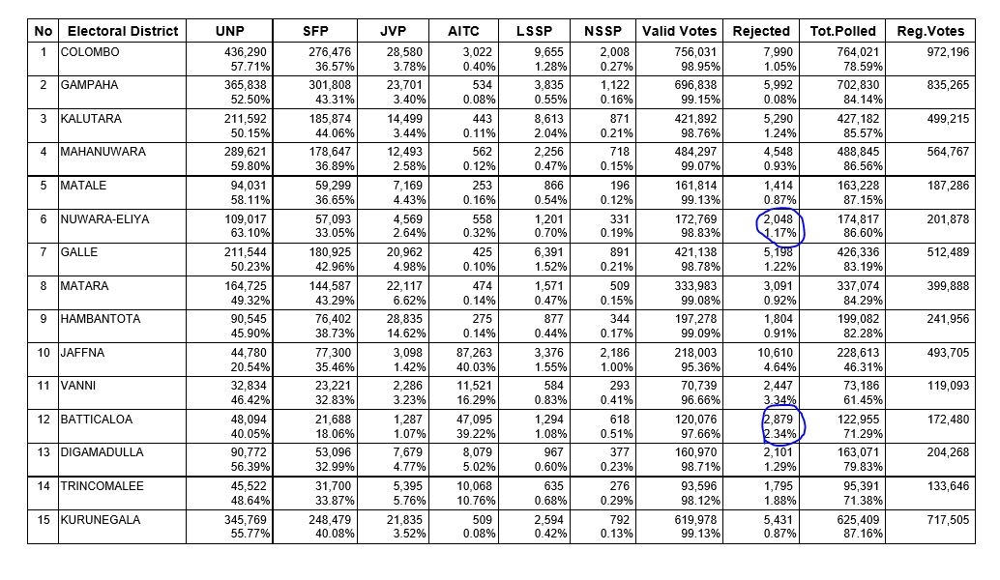

```{r Total rejected Nuwara-Eliya District}
ElecFinal1982<-subset(Election1982, District=="Nuwara-Eliya" & Electorate !="Total"
                      & ColNames=="No of Rejected Votes")

ElecFinal1982[,sum(Votes,na.rm = TRUE),by="ColNames"]
```

```{r Total rejected}
# Extracting only Final District Results of 
# No of Rejected Votes
# and then adding all the votes 
ElecFinal1982<-subset(Election1982,Electorate=="Total" 
                      & ColNames=="No of Rejected Votes")
# added votes will be cross checked with the pdf document
ElecFinal1982[,sum(Votes,na.rm = TRUE),by="ColNames"]

# Extracting except Final District Results of 
# No of Rejected Votes
# and then adding all the votes 
ElecFinal1982<-subset(Election1982,Electorate!="Total" 
                      & ColNames=="No of Rejected Votes")
# added votes will be cross checked with the pdf document
ElecFinal1982[,sum(Votes,na.rm = TRUE),by="ColNames"]
```

From the two values second value is more accurate, which means 10 votes 
are not added. They are from the Batticaloa district.

### Batticaloa District

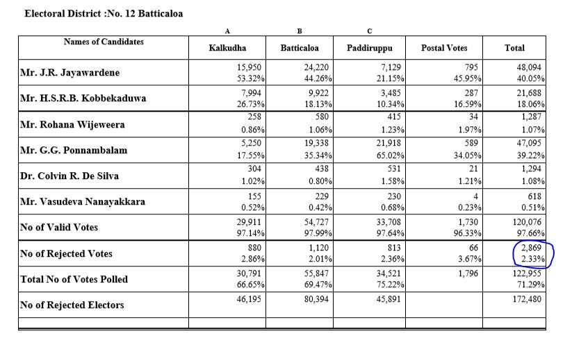

```{r Total rejected Batticaloa District}
ElecFinal1982<-subset(Election1982, District=="Batticaloa" & Electorate !="Total"
                      & ColNames=="No of Rejected Votes")

ElecFinal1982[,sum(Votes,na.rm = TRUE),by="ColNames"]
```

So the Final Vote count for No of Rejected Votes is 80500.

## Checking for Valid Votes


The district tally indicates the Total Valid count is
6522147, but the electorate tally indicates the Total
Valid count as 6522153. There is a six vote difference. 

```{r Total Valid}
# Extracting only Final District Results of 
# No of Valid Votes
# and then adding all the votes 
ElecFinal1982<-subset(Election1982,Electorate=="Total" 
                      & ColNames=="No of Valid Votes")
# added votes will be cross checked with the pdf document
ElecFinal1982[,sum(Votes),by="ColNames"]

# Extracting except Final District Results of 
# No of Valid Votes
# and then adding all the votes 
ElecFinal1982<-subset(Election1982,Electorate!="Total" 
                      & ColNames=="No of Valid Votes")
# added votes will be cross checked with the pdf document
ElecFinal1982[,sum(Votes),by="ColNames"]
```

### Gampaha District

This six vote difference occurs because of the Gampaha district 
count. The actual count should be 696844 but the printed value is 
696838. If we rectify this the problem will be solved.

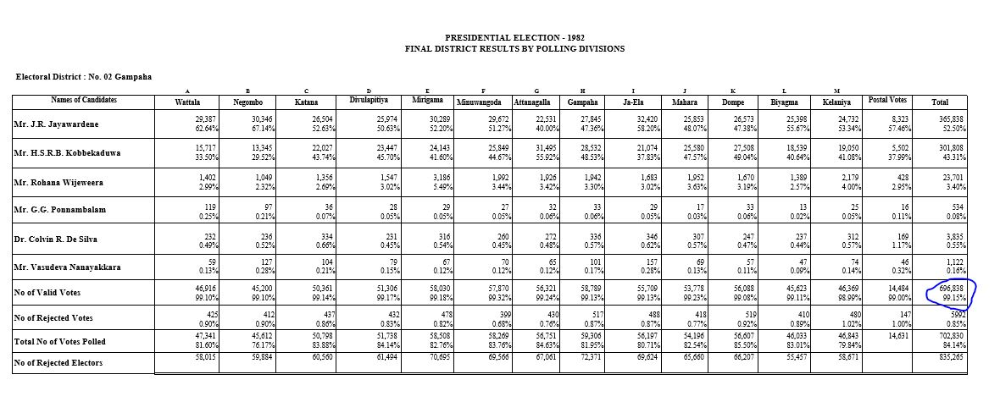

```{r Gampaha District Valid}
ElecFinal1982<-subset(Election1982,Electorate!="Total" 
                      & District=="Gampaha"
                      & ColNames=="No of Valid Votes")

ElecFinal1982[,sum(Votes),by="ColNames"]
```

## Comparing final tally votes of Mr.J.R. Jayawardene

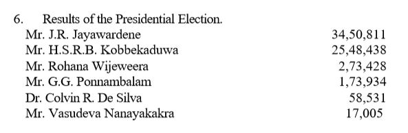

Second votes value of 3450815 is accurate, because it is directly 
from the electorates. There is a 4 vote difference.

```{r Validating the data 1}
# Extracting only Final District Results of 
# Mr.J.R. Jayawardene
# and then adding all the votes 
ElecFinal1982<-subset(Election1982,Electorate=="Total" 
                      & ColNames=="Mr.J.R. Jayawardene")
# added votes will be cross checked with the pdf document
ElecFinal1982[,sum(Votes),by="ColNames"]

# Extracting except Final District Results of 
# Mr.J.R. Jayawardene
# and then adding all the votes 
ElecFinal1982<-subset(Election1982,Electorate!="Total" 
                      & ColNames=="Mr.J.R. Jayawardene")
# added votes will be cross checked with the pdf document
ElecFinal1982[,sum(Votes,na.rm = TRUE),by="ColNames"]
```

### Gampaha District

In the Gampaha district the real vote count should be 365847
but it printed as 365838.  Which is a 9 vote deficit.

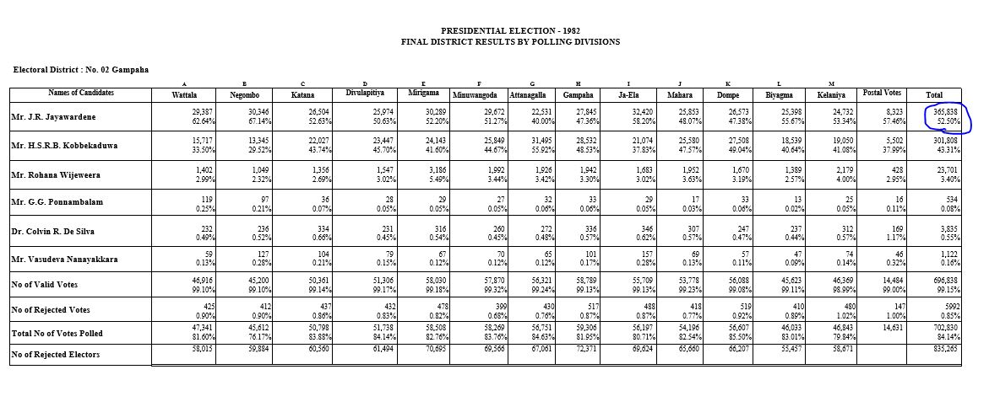

```{r Gampaha District JR}
ElecFinal1982<-subset(Election1982,Electorate!="Total" 
                      & District=="Gampaha"
                      & ColNames=="Mr.J.R. Jayawardene")

ElecFinal1982[,sum(Votes,na.rm = TRUE),by="ColNames"]
```

### Jaffna District

In the Jaffna district the real vote count should be 44775,
but it is misprinted as 44780. 

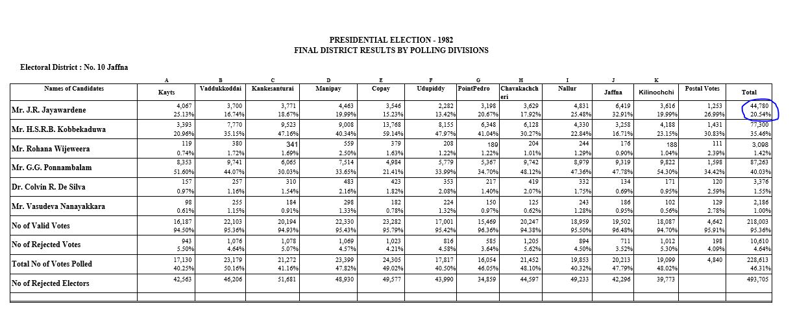

```{r Jaffna District JR}
ElecFinal1982<-subset(Election1982,Electorate!="Total" 
                      & District=="Jaffna"
                      & ColNames=="Mr.J.R. Jayawardene")

ElecFinal1982[,sum(Votes,na.rm = TRUE),by="ColNames"]
```

If we consider the 9 vote deficit and 5 votes extra clearly
there is a 4 vote deficit. This matches our final conclusion
that the Total vote count for J.R Jayawardane is 3450815.

## Comparing final tally votes of Mr.H.S.R.B.K. Kobbekaduwa


No issues here. It should be 2546438 but mistakenly added 
2548438 is what I believe.

```{r Vaildating the data 2}
# Extracting only Final District Results of 
# Mr.H.S.R.B.K. Kobbekaduwa
# and then adding all the votes 
ElecFinal1982<-subset(Election1982,Electorate=="Total" 
                      & ColNames=="Mr.H.S.R.B.K. Kobbekaduwa")
# added votes will be cross checked with the pdf document
ElecFinal1982[,sum(Votes),by="ColNames"]

# Extracting except Final District Results of 
# Mr.H.S.R.B.K. Kobbekaduwa
# and then adding all the votes 
ElecFinal1982<-subset(Election1982,Electorate!="Total" 
                      & ColNames=="Mr.H.S.R.B.K. Kobbekaduwa")
# added votes will be cross checked with the pdf document
ElecFinal1982[,sum(Votes,na.rm = TRUE),by="ColNames"]
```

## Comparing final tally votes of  Mr. Rohana Wijeweera  

No issues here.


```{r Vaildating the data 3}
# Extracting only Final District Results of 
#  Mr. Rohana Wijeweera 
# and then adding all the votes 
ElecFinal1982<-subset(Election1982,Electorate=="Total" 
                      & ColNames=="Mr. Rohana Wijeweera")
# added votes will be cross checked with the pdf document
ElecFinal1982[,sum(Votes),by="ColNames"]

# Extracting except Final District Results of 
# Mr. Rohana Wijeweera 
# and then adding all the votes 
ElecFinal1982<-subset(Election1982,Electorate!="Total" 
                      & ColNames=="Mr. Rohana Wijeweera")
# added votes will be cross checked with the pdf document
ElecFinal1982[,sum(Votes,na.rm = TRUE),by="ColNames"]
```

## Comparing final tally votes of  Mr. G.G. Ponnambalam  

No issues here.


```{r Vaildating the data 4}
# Extracting only Final District Results of 
#  Mr. G.G. Ponnambalam 
# and then adding all the votes 
ElecFinal1982<-subset(Election1982,Electorate=="Total" 
                      & ColNames=="Mr.G.G. Ponnambalam")
# added votes will be cross checked with the pdf document
ElecFinal1982[,sum(Votes),by="ColNames"]

# Extracting except Final District Results of 
# Mr. G.G. Ponnambalam
# and then adding all the votes 
ElecFinal1982<-subset(Election1982,Electorate!="Total" 
                      & ColNames=="Mr.G.G. Ponnambalam")
# added votes will be cross checked with the pdf document
ElecFinal1982[,sum(Votes,na.rm = TRUE),by="ColNames"]
```

## Comparing final tally votes of  Dr. Colvin R. De Silva   

436 votes extra, which occurs because of the Colombo district tallying.
The correct Total Vote count for Dr. Colvin R. De Silva is 58095.


```{r Vaildating the data 5}
# Extracting only Final District Results of 
# Dr. Colvin R. De Silva 
# and then adding all the votes 
ElecFinal1982<-subset(Election1982,Electorate=="Total" 
                      & ColNames=="Dr. Colvin R. De Silva")
# added votes will be cross checked with the pdf document
ElecFinal1982[,sum(Votes),by="ColNames"]

# Extracting except Final District Results of 
# Dr. Colvin R. De Silva 
# and then adding all the votes 
ElecFinal1982<-subset(Election1982,Electorate!="Total" 
                      & ColNames=="Dr. Colvin R. De Silva")
# added votes will be cross checked with the pdf document
ElecFinal1982[,sum(Votes,na.rm = TRUE),by="ColNames"]
```

### Colombo District


Total Votes count for Dr Colvin R. De Silva from Colombo district should 
be 9219 but mistakenly printed has 9655. If we rectify this the problem
will be resolved.

```{r Colombo District Dr}
ElecFinal1982<-subset(Election1982,Electorate!="Total" 
                      & District=="Colombo"
                      & ColNames=="Dr. Colvin R. De Silva")

ElecFinal1982[,sum(Votes,na.rm = TRUE),by="ColNames"]
```

## Comparing final tally votes of  Mr. Vasudeva Nanayakakra   

10 votes extra, this is happening because of the Jaffna district. 
The correct Total vote count is 16995.


```{r Vaildating the data 6}
# Extracting only Final District Results of 
# Mr. Vasudeva Nanayakakra 
# and then adding all the votes 
ElecFinal1982<-subset(Election1982,Electorate=="Total" 
                      & ColNames=="Mr. Vasudeva Nanayakkara")
# added votes will be cross checked with the pdf document
ElecFinal1982[,sum(Votes),by="ColNames"]

# Extracting except Final District Results of 
# Mr. Vasudeva Nanayakakra 
# and then adding all the votes 
ElecFinal1982<-subset(Election1982,Electorate!="Total" 
                      & ColNames=="Mr. Vasudeva Nanayakkara")
# added votes will be cross checked with the pdf document
ElecFinal1982[,sum(Votes,na.rm = TRUE),by="ColNames"]
```

### Jaffna District

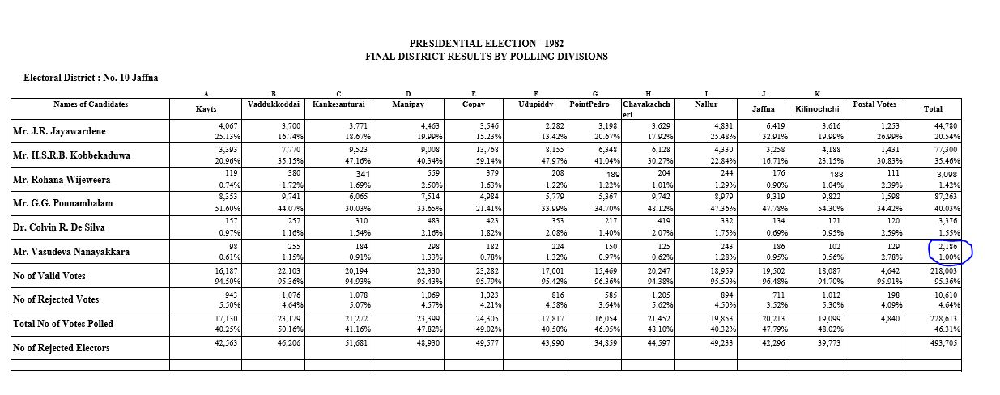

The total vote count Mr Vasudeva Nanayakkara in Jaffna 
district is 2176 but in the table it is misprinted as 
2186.

```{r Jaffna District}
ElecFinal1982<-subset(Election1982,Electorate!="Total" 
                      & District== "Jaffna"
                      & ColNames=="Mr. Vasudeva Nanayakkara")

ElecFinal1982[,sum(Votes,na.rm = TRUE),by="ColNames"]
```

*THANK YOU*