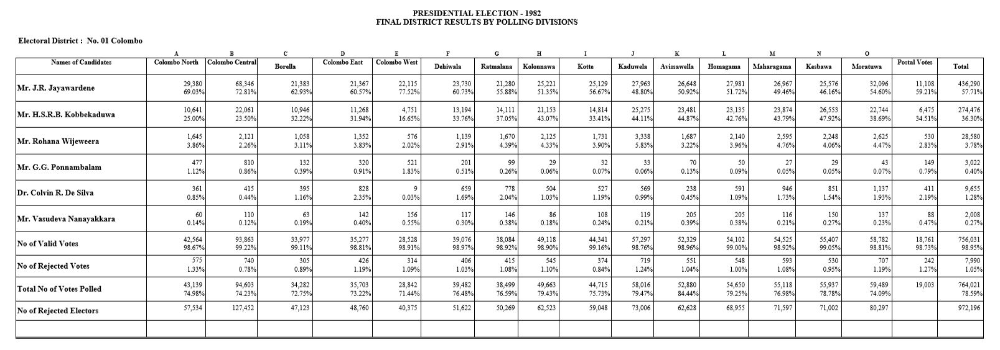
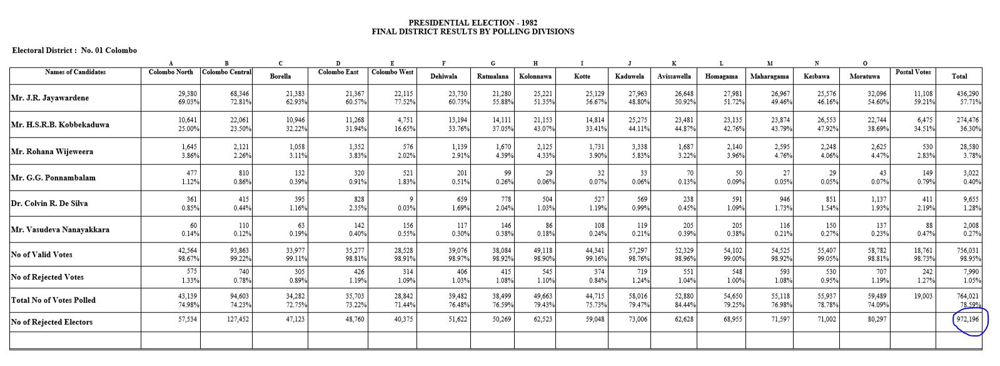
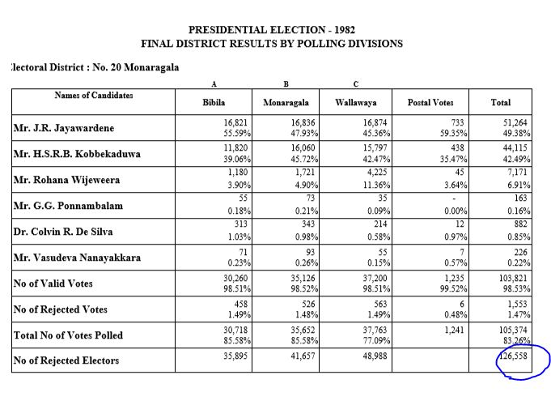
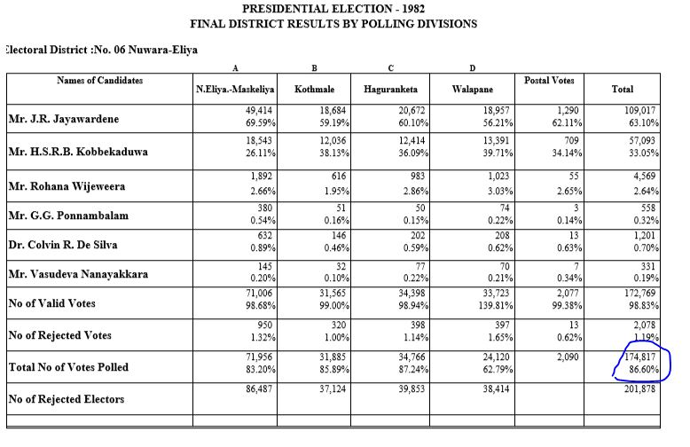
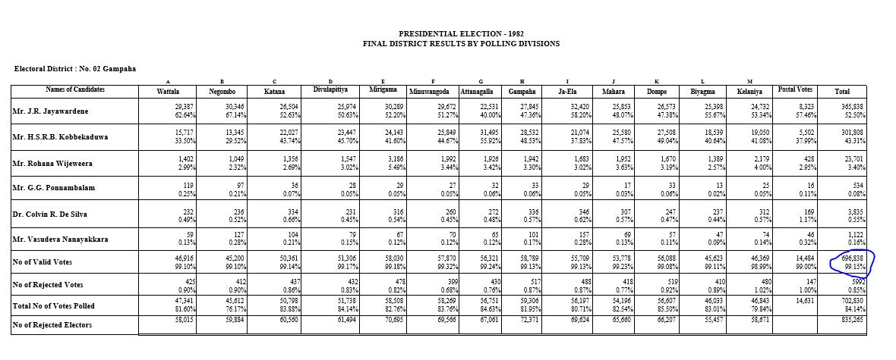
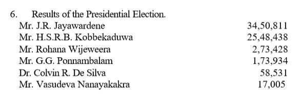
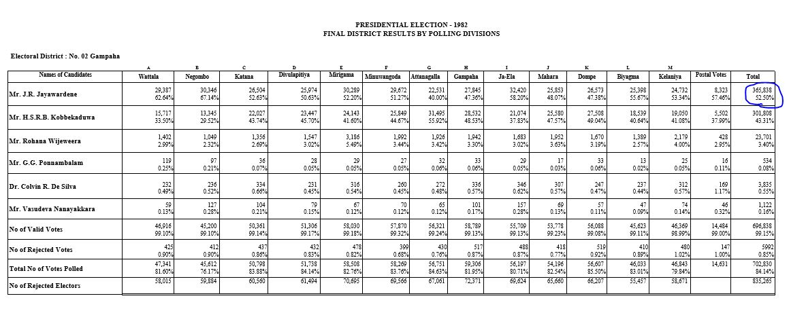
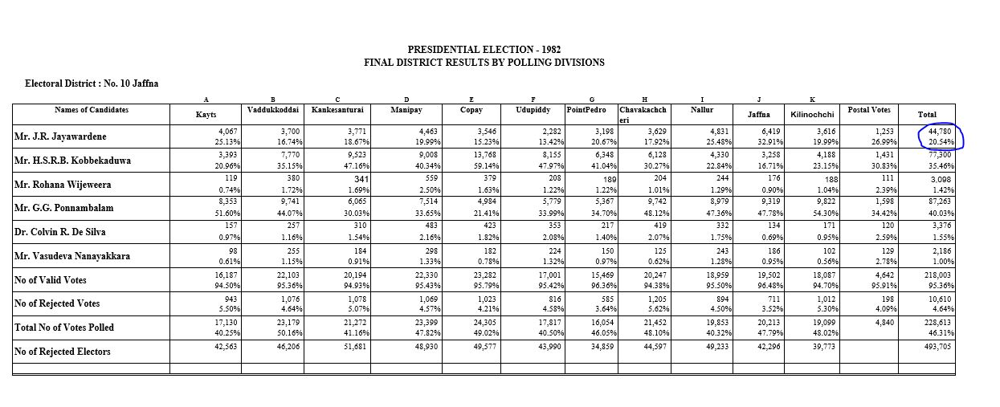
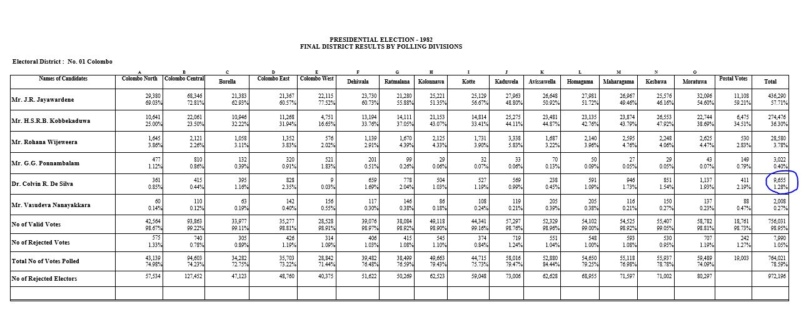
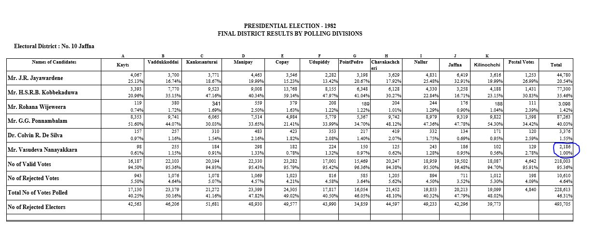

Election1982
================

# Structure of Document

Data extraction begins from page 4 of the document. Each page from here
has a table representing each district. All tables follow the similar
format.

If we consider the columns, first column is for candidate names with
other counts, second column and its consecutive columns are for
electorates. Final two columns are Postal Votes and Final District
Results.

Each cell has two numeric values which are number of votes and
percentages, this is true except for the last row. First 3 rows are for
candidates names, followed by No of Valid Votes, No of Rejected Votes,
Total No of Votes Polled and finally Total No of Registered Electors but
mistakenly written as No of Rejected Electors.



# Process of Extraction

Each table has been extracted separately without any issues. Two inputs
are used, one is page number and other is for special cases of several
districts. Two functions were created to extract two types of tables,
yet both of them look similar except a few anomalies.

``` r
# load the pdf file
SL_PE_1982<-pdf_text("PresidentialElections1982.pdf")

# source the function
source("Extract1982.R")

# creating initial dataset Election1994
Election1982<-NULL

# special pages which has the same format 
pages<-c(8:9,11,14:17,19,23,25)

for (i in pages) 
{
    Election1982[[i]]<-Extract_Table1982(i)    
}
    Election1982[[4]]<-Extract_Table1982(4,Colo=TRUE)    

    Election1982[[7]]<-Extract_Table1982(7,Maha=TRUE)
    
    Election1982[[10]]<-Extract_Table1982(10,Ga=TRUE)
    
    Election1982[[18]]<-Extract_Table1982(18,Kur=TRUE)    
    
    Election1982[[24]]<-Extract_Table1982(24,Keg = TRUE)        

    Election1982[[5]]<-Extract_Table2_1982(5,Gam=TRUE)
    
    Election1982[[6]]<-Extract_Table2_1982(6)

    Election1982[[12]]<-Extract_Table2_1982(12,HP=TRUE)
    
    Election1982[[21]]<-Extract_Table2_1982(21,HP=TRUE)
    
    Election1982[[13]]<-Extract_Table2_1982(13,Jaf=TRUE)    
    
    Election1982[[20]]<-Extract_Table2_1982(20,Anu = TRUE)        
    
    Election1982[[22]]<-Extract_Table2_1982(22,Bad = TRUE)        
        
# final data set
Election1982<-do.call("rbind",Election1982)
```

# Validating Data Extracted

## Checking for Number of Registered Electors.

It should have been 8117015(still mis calculated) but mistakenly written
as 8145015.


``` r
# Extracting only Final District District Results of 
# Number of Registered Electors
# and then adding all the votes 
ElecFinal1982<-subset(Election1982,Electorate=="Total" 
                      & ColNames=="No of Registered Electors")
# added votes will be cross checked with the pdf document
ElecFinal1982[,sum(Votes,na.rm = TRUE),by="ColNames"]
```

    ##                     ColNames      V1
    ## 1: No of Registered Electors 8117025

``` r
# Extracting except Final District District Results of 
# Number of Registered Electors
# and then adding all the votes 
ElecFinal1982<-subset(Election1982,Electorate!="Total" 
                      & ColNames=="No of Registered Electors")
# added votes will be cross checked with the pdf document
ElecFinal1982[,sum(Votes,na.rm = TRUE),by="ColNames"]
```

    ##                     ColNames      V1
    ## 1: No of Registered Electors 8116992

8116992 is more accurate than 8117025. Because the values are directly
from the electorates than the tallied district tables. Exactly 33 extra
votes are added because of mis calculation.

### Colombo District



``` r
ElecFinal1982<-subset(Election1982, District=="Colombo" & Electorate !="Total"
                      & ColNames=="No of Registered Electors")

ElecFinal1982[,sum(Votes,na.rm = TRUE),by="ColNames"]
```

    ##                     ColNames     V1
    ## 1: No of Registered Electors 972191

The tallied table has 5 extra votes.

### Matale District


``` r
ElecFinal1982<-subset(Election1982, District=="Matale" & Electorate !="Total"
                      & ColNames=="No of Registered Electors")

ElecFinal1982[,sum(Votes,na.rm = TRUE),by="ColNames"]
```

    ##                     ColNames     V1
    ## 1: No of Registered Electors 187276

The tallied table has 10 extra votes.

### Monaragala District



``` r
ElecFinal1982<-subset(Election1982, District=="Monaragala" & Electorate !="Total"
                      & ColNames=="No of Registered Electors")

ElecFinal1982[,sum(Votes,na.rm = TRUE),by="ColNames"]
```

    ##                     ColNames     V1
    ## 1: No of Registered Electors 126540

The tallied table has 18 extra votes. So there is 33 votes extra in the
tallied vote count. Final Count for No of Registered Electors is
8116992.

## Total Polled


``` r
# Extracting only Final District District Results of 
# Total Polled
# and then adding all the votes 
ElecFinal1982<-subset(Election1982,Electorate=="Total" 
                      & ColNames=="Total No of Votes Polled")
# added votes will be cross checked with the pdf document
ElecFinal1982[,sum(Votes,na.rm = TRUE),by="ColNames"]
```

    ##                    ColNames      V1
    ## 1: Total No of Votes Polled 6602617

``` r
# Extracting except Final District District Results of 
# Total Polled
# and then adding all the votes 
ElecFinal1982<-subset(Election1982,Electorate!="Total" 
                      & ColNames=="Total No of Votes Polled")
# added votes will be cross checked with the pdf document
ElecFinal1982[,sum(Votes,na.rm = TRUE),by="ColNames"]
```

    ##                    ColNames      V1
    ## 1: Total No of Votes Polled 6592617

There is exactly 10000 votes extra in the tallied district tables.

### Nuwara-Eliya District



``` r
ElecFinal1982<-subset(Election1982, District=="Nuwara-Eliya" & Electorate !="Total"
                      & ColNames=="Total No of Votes Polled")

ElecFinal1982[,sum(Votes,na.rm = TRUE),by="ColNames"]
```

    ##                    ColNames     V1
    ## 1: Total No of Votes Polled 164817

Extra 10000 votes are from miscalculation of the Nuwara-Eliya district.
So the final value for Total No of Votes Polled is 6592617.

## Total Rejected


The value for rejected votes is not true here because the value for
Nuwara-Eliya district is wrong in this district tallied table. Which
means 30 votes are not added properly


``` r
ElecFinal1982<-subset(Election1982, District=="Nuwara-Eliya" & Electorate !="Total"
                      & ColNames=="No of Rejected Votes")

ElecFinal1982[,sum(Votes,na.rm = TRUE),by="ColNames"]
```

    ##                ColNames   V1
    ## 1: No of Rejected Votes 2078

``` r
# Extracting only Final District District Results of 
# No of Rejected Votes
# and then adding all the votes 
ElecFinal1982<-subset(Election1982,Electorate=="Total" 
                      & ColNames=="No of Rejected Votes")
# added votes will be cross checked with the pdf document
ElecFinal1982[,sum(Votes,na.rm = TRUE),by="ColNames"]
```

    ##                ColNames    V1
    ## 1: No of Rejected Votes 80490

``` r
# Extracting except Final District District Results of 
# No of Rejected Votes
# and then adding all the votes 
ElecFinal1982<-subset(Election1982,Electorate!="Total" 
                      & ColNames=="No of Rejected Votes")
# added votes will be cross checked with the pdf document
ElecFinal1982[,sum(Votes,na.rm = TRUE),by="ColNames"]
```

    ##                ColNames    V1
    ## 1: No of Rejected Votes 80500

From the two values second value is more accurate, which means 10 votes
are not added. They are from the Batticaloa district.

### Batticaloa District


``` r
ElecFinal1982<-subset(Election1982, District=="Batticaloa" & Electorate !="Total"
                      & ColNames=="No of Rejected Votes")

ElecFinal1982[,sum(Votes,na.rm = TRUE),by="ColNames"]
```

    ##                ColNames   V1
    ## 1: No of Rejected Votes 2879

So the Final Vote count for No of Rejected Votes is 80500.

## Total Valid


The district tally indicates the Total Valid count is 6522147, but the
electorate tally indicates the Total Valid count as 6522153. There is a
six vote difference.

``` r
# Extracting only Final District District Results of 
# No of Valid Votes
# and then adding all the votes 
ElecFinal1982<-subset(Election1982,Electorate=="Total" 
                      & ColNames=="No of Valid Votes")
# added votes will be cross checked with the pdf document
ElecFinal1982[,sum(Votes),by="ColNames"]
```

    ##             ColNames      V1
    ## 1: No of Valid Votes 6522147

``` r
# Extracting except Final District District Results of 
# No of Valid Votes
# and then adding all the votes 
ElecFinal1982<-subset(Election1982,Electorate!="Total" 
                      & ColNames=="No of Valid Votes")
# added votes will be cross checked with the pdf document
ElecFinal1982[,sum(Votes),by="ColNames"]
```

    ##             ColNames      V1
    ## 1: No of Valid Votes 6522153

### Gampaha District

This six vote difference occurs because of the Gampaha district count.
The actual count should be 696844 but the printed value is 696838. If we
rectify this the problem will be solved.



``` r
ElecFinal1982<-subset(Election1982,Electorate!="Total" 
                      & District=="Gampaha"
                      & ColNames=="No of Valid Votes")

ElecFinal1982[,sum(Votes),by="ColNames"]
```

    ##             ColNames     V1
    ## 1: No of Valid Votes 696844

## Comparing final tally votes of Mr.J.R. Jayawardene



Second votes value of 3450815 is accurate, because it is directly from
the electorates. There is a 4 vote difference.

``` r
# Extracting only Final District District Results of 
# Mr.J.R. Jayawardene
# and then adding all the votes 
ElecFinal1982<-subset(Election1982,Electorate=="Total" 
                      & ColNames=="Mr.J.R. Jayawardene")
# added votes will be cross checked with the pdf document
ElecFinal1982[,sum(Votes),by="ColNames"]
```

    ##               ColNames      V1
    ## 1: Mr.J.R. Jayawardene 3450811

``` r
# Extracting except Final District District Results of 
# Mr.J.R. Jayawardene
# and then adding all the votes 
ElecFinal1982<-subset(Election1982,Electorate!="Total" 
                      & ColNames=="Mr.J.R. Jayawardene")
# added votes will be cross checked with the pdf document
ElecFinal1982[,sum(Votes,na.rm = TRUE),by="ColNames"]
```

    ##               ColNames      V1
    ## 1: Mr.J.R. Jayawardene 3450815

### Gampaha District

In the Gampaha district the real vote count should be 365847 but it
printed as 365838. Which is a 9 vote defecit.



``` r
ElecFinal1982<-subset(Election1982,Electorate!="Total" 
                      & District=="Gampaha"
                      & ColNames=="Mr.J.R. Jayawardene")

ElecFinal1982[,sum(Votes,na.rm = TRUE),by="ColNames"]
```

    ##               ColNames     V1
    ## 1: Mr.J.R. Jayawardene 365847

### Jaffna District

In the Jaffna district the real vote count should be 44775, but it is
misprinted as 44780.



``` r
ElecFinal1982<-subset(Election1982,Electorate!="Total" 
                      & District=="Jaffna"
                      & ColNames=="Mr.J.R. Jayawardene")

ElecFinal1982[,sum(Votes,na.rm = TRUE),by="ColNames"]
```

    ##               ColNames    V1
    ## 1: Mr.J.R. Jayawardene 44775

If we consider the 9 vote defecit and 5 votes extra clearly there is a 4
vote defecit. This matches our final conclusion that the Total vote
count for J.R Jayawardane is 3450815.

## Comparing final tally votes of Mr.H.S.R.B.K. Kobbekaduwa


No issues here. It should be 2546438 but mistakenly added 2548438 is
what i believe.

``` r
# Extracting only Final District District Results of 
# Mr.H.S.R.B.K. Kobbekaduwa
# and then adding all the votes 
ElecFinal1982<-subset(Election1982,Electorate=="Total" 
                      & ColNames=="Mr.H.S.R.B.K. Kobbekaduwa")
# added votes will be cross checked with the pdf document
ElecFinal1982[,sum(Votes),by="ColNames"]
```

    ##                     ColNames      V1
    ## 1: Mr.H.S.R.B.K. Kobbekaduwa 2546438

``` r
# Extracting except Final District District Results of 
# Mr.H.S.R.B.K. Kobbekaduwa
# and then adding all the votes 
ElecFinal1982<-subset(Election1982,Electorate!="Total" 
                      & ColNames=="Mr.H.S.R.B.K. Kobbekaduwa")
# added votes will be cross checked with the pdf document
ElecFinal1982[,sum(Votes,na.rm = TRUE),by="ColNames"]
```

    ##                     ColNames      V1
    ## 1: Mr.H.S.R.B.K. Kobbekaduwa 2546438

## Comparing final tally votes of Mr. Rohana Wijeweera

No issues here.


``` r
# Extracting only Final District District Results of 
#  Mr. Rohana Wijeweera 
# and then adding all the votes 
ElecFinal1982<-subset(Election1982,Electorate=="Total" 
                      & ColNames=="Mr. Rohana Wijeweera")
# added votes will be cross checked with the pdf document
ElecFinal1982[,sum(Votes),by="ColNames"]
```

    ##                ColNames     V1
    ## 1: Mr. Rohana Wijeweera 273428

``` r
# Extracting except Final District District Results of 
# Mr. Rohana Wijeweera 
# and then adding all the votes 
ElecFinal1982<-subset(Election1982,Electorate!="Total" 
                      & ColNames=="Mr. Rohana Wijeweera")
# added votes will be cross checked with the pdf document
ElecFinal1982[,sum(Votes,na.rm = TRUE),by="ColNames"]
```

    ##                ColNames     V1
    ## 1: Mr. Rohana Wijeweera 273428

## Comparing final tally votes of Mr. G.G. Ponnambalam

No issues here.


``` r
# Extracting only Final District District Results of 
#  Mr. G.G. Ponnambalam 
# and then adding all the votes 
ElecFinal1982<-subset(Election1982,Electorate=="Total" 
                      & ColNames=="Mr.G.G. Ponnambalam")
# added votes will be cross checked with the pdf document
ElecFinal1982[,sum(Votes),by="ColNames"]
```

    ##               ColNames     V1
    ## 1: Mr.G.G. Ponnambalam 173934

``` r
# Extracting except Final District District Results of 
# Mr. G.G. Ponnambalam
# and then adding all the votes 
ElecFinal1982<-subset(Election1982,Electorate!="Total" 
                      & ColNames=="Mr.G.G. Ponnambalam")
# added votes will be cross checked with the pdf document
ElecFinal1982[,sum(Votes,na.rm = TRUE),by="ColNames"]
```

    ##               ColNames     V1
    ## 1: Mr.G.G. Ponnambalam 173934

## Comparing final tally votes of Dr. Colvin R. De Silva

436 votes extra, which occurs because of the Colombo district tallying.
The correct Total Votes count for Dr. Colvin R. De Silva is 58095.


``` r
# Extracting only Final District District Results of 
# Dr. Colvin R. De Silva 
# and then adding all the votes 
ElecFinal1982<-subset(Election1982,Electorate=="Total" 
                      & ColNames=="Dr. Colvin R. De Silva")
# added votes will be cross checked with the pdf document
ElecFinal1982[,sum(Votes),by="ColNames"]
```

    ##                  ColNames    V1
    ## 1: Dr. Colvin R. De Silva 58531

``` r
# Extracting except Final District District Results of 
# Dr. Colvin R. De Silva 
# and then adding all the votes 
ElecFinal1982<-subset(Election1982,Electorate!="Total" 
                      & ColNames=="Dr. Colvin R. De Silva")
# added votes will be cross checked with the pdf document
ElecFinal1982[,sum(Votes,na.rm = TRUE),by="ColNames"]
```

    ##                  ColNames    V1
    ## 1: Dr. Colvin R. De Silva 58095

### Colombo District



Total Votes count for Dr Colvin R. De Silva from Colombo district should
be 9219 but mistakenly printed has 9655. If we rectify this the problem
will be resolved.

``` r
ElecFinal1982<-subset(Election1982,Electorate!="Total" 
                      & District=="Colombo"
                      & ColNames=="Dr. Colvin R. De Silva")

ElecFinal1982[,sum(Votes,na.rm = TRUE),by="ColNames"]
```

    ##                  ColNames   V1
    ## 1: Dr. Colvin R. De Silva 9219

## Comparing final tally votes of Mr. Vasudeva Nanayakakra

10 votes extra, this is happening because of the Jaffna district. The
correct Total votes count is 16995.


``` r
# Extracting only Final District District Results of 
# Mr. Vasudeva Nanayakakra 
# and then adding all the votes 
ElecFinal1982<-subset(Election1982,Electorate=="Total" 
                      & ColNames=="Mr. Vasudeva Nanayakkara")
# added votes will be cross checked with the pdf document
ElecFinal1982[,sum(Votes),by="ColNames"]
```

    ##                    ColNames    V1
    ## 1: Mr. Vasudeva Nanayakkara 17005

``` r
# Extracting except Final District District Results of 
# Mr. Vasudeva Nanayakakra 
# and then adding all the votes 
ElecFinal1982<-subset(Election1982,Electorate!="Total" 
                      & ColNames=="Mr. Vasudeva Nanayakkara")
# added votes will be cross checked with the pdf document
ElecFinal1982[,sum(Votes,na.rm = TRUE),by="ColNames"]
```

    ##                    ColNames    V1
    ## 1: Mr. Vasudeva Nanayakkara 16995

### Jaffna District



The total vote count Mr Vasudeva Nanayakkara in Jaffna district is 2176
but in the table it is misprinted as 2186.

``` r
ElecFinal1982<-subset(Election1982,Electorate!="Total" 
                      & District== "Jaffna"
                      & ColNames=="Mr. Vasudeva Nanayakkara")

ElecFinal1982[,sum(Votes,na.rm = TRUE),by="ColNames"]
```

    ##                    ColNames   V1
    ## 1: Mr. Vasudeva Nanayakkara 2176

Second value is more accurate because it is directly from the
electorates.

*THANK YOU*
