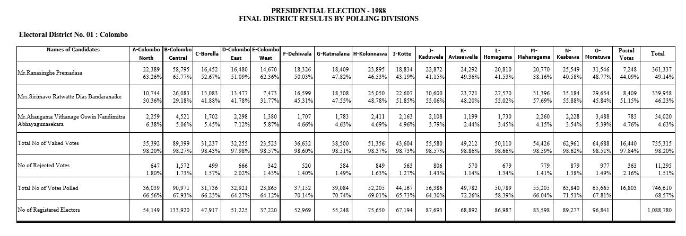
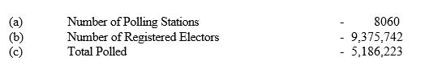
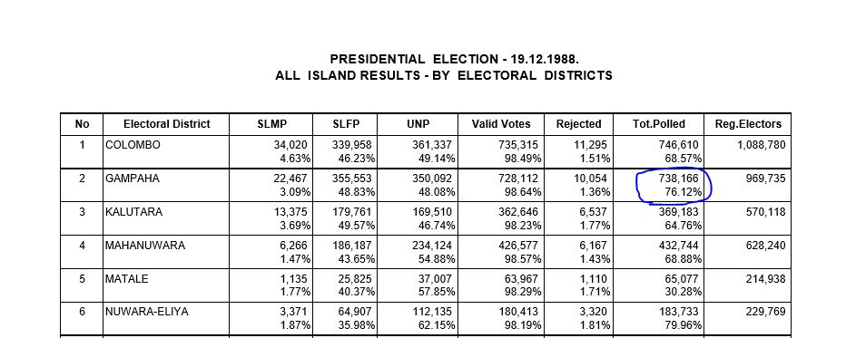
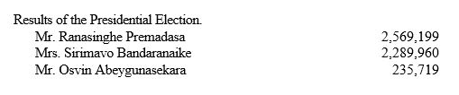
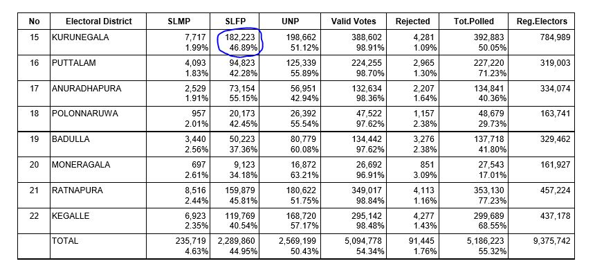
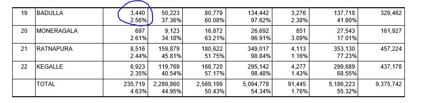

```{r setup, include=FALSE}
knitr::opts_chunk$set(echo = TRUE,warning = FALSE)

# Load the packages
library(data.table)
library(stringr)
library(splitstackshape)
library(pdftools)
```

# Structure of Document

Data extraction begins from page four of the document. Each page from here has a 
table representing  each district. All tables follow the similar format. 

If we consider the columns, first column is for candidate names with other counts,
second column and its consecutive columns are for electorates. Final two columns
are Postal Votes and Final District Results. 

Each cell has two numeric values which are number of votes and percentages, this is 
true except for the last row. First 3 rows are for candidates names, followed by 
Total No of Valid Votes, Total No of Rejected Votes, Total No of votes polled and 
finally Total No of Registered Electors.



# Process of Extraction

Each table has been extracted separately without any issues. Two inputs are 
used, one is page number other is for special cases for several districts. 
Two functions were created to extract two types of tables, yet both of them
look similar except a few anomalies

```{r Election 1988}
# load the pdf file
SL_PE_1988<-pdf_text("PresidentialElections1988.pdf")

# source the function
source("Extract1988.R")

# creating initial dataset Election1994
Election1988<-NULL

# special pages which has the same format 
pages<-c(6,16,17,24)

for (i in pages) 
    {
    Election1988[[i]]<-Extract_Type1_1988(i)
    }
# extracting from Colombo District
    Election1988[[4]]<-Extract_Type1_1988(4,Colo = TRUE)
# extracting from Gampaha District
    Election1988[[5]]<-Extract_Type1_1988(5,Ga = TRUE)    
# extracting from Matale District
    Election1988[[8]]<-Extract_Type1_1988(8,Mat = TRUE)
# extracting from Nuwara-Eliya District    
    Election1988[[9]]<-Extract_Type1_1988(9,NE = TRUE)
# extracting from Vanni District    
    Election1988[[14]]<-Extract_Type1_1988(14,Van = TRUE)
# extracting from Batticaloa District    
    Election1988[[15]]<-Extract_Type1_1988(15,Bat = TRUE)
# extracting from Puttalam District    
    Election1988[[19]]<-Extract_Type1_1988(19,Put = TRUE)
# extracting from Polonnaruwa District    
    Election1988[[21]]<-Extract_Type1_1988(21,Pol = TRUE)
# extracting from Badulla District    
    Election1988[[22]]<-Extract_Type1_1988(22,Ba = TRUE)
# extracting from Moneragala District    
    Election1988[[23]]<-Extract_Type1_1988(23,Mon = TRUE)
# extracting from Kegalle District    
    Election1988[[25]]<-Extract_Type1_1988(25,Ke = TRUE)
# extracting from Mahanuwara District
    Election1988[[7]]<-Extract_Type2_1988(7,Ma=TRUE)
# extracting from Jaffna District
    Election1988[[13]]<-Extract_Type2_1988(13,Ja=TRUE)
# extracting from Kurunegala District
    Election1988[[18]]<-Extract_Type2_1988(18,Ku=TRUE)
# extracting from Anuradhapura District
    Election1988[[20]]<-Extract_Type2_1988(20,Anu=TRUE)
# extracting from Galle District
    Election1988[[10]]<-Extract_Type2_1988(10,Ga=TRUE)
# extracting from Matara District
    Election1988[[11]]<-Extract_Type2_1988(11,Mat=TRUE)
# extracting from Hambantota District
    Election1988[[12]]<-Extract_Type2_1988(12,Ha=TRUE)

# final data set
Election1988<-do.call("rbind",Election1988)
```

# Validating Data Extracted

There is a summary for election results yet both way tallying
is compared between the extracted data. Also both way tallying is
used to clarify the summary as well. Both Way Tallying means summation of 
all district final results is equal to summation of all electorates final results.

## Checking for Registered Electors.

No issues here.



```{r Reg electors}
# Extracting only Final District Results of 
# Number of Registered Electors
# and then adding all the votes 
ElecFinal1988<-subset(Election1988,Electorate=="Total" 
                      & ColNames=="No of Registered Electors")
# added votes will be cross checked with the pdf document
ElecFinal1988[,sum(Votes,na.rm = TRUE),by="ColNames"]

# Extracting except Final District Results of 
# Number of Registered Electors
# and then adding all the votes 
ElecFinal1988<-subset(Election1988,Electorate!="Total" 
                      & ColNames=="No of Registered Electors")
# added votes will be cross checked with the pdf document
ElecFinal1988[,sum(Votes,na.rm = TRUE),by="ColNames"]
```

## Checking for Total Polled

54 votes are missing in the district summary table.


```{r Total Polled}
# Extracting only Final District Results of 
# Total Polled
# and then adding all the votes 
ElecFinal1988<-subset(Election1988,Electorate=="Total" 
                      & ColNames=="Total No of Votes Polled")
# added votes will be cross checked with the pdf document
ElecFinal1988[,sum(Votes,na.rm = TRUE),by="ColNames"]

# Extracting except Final District Results of 
# Total Polled
# and then adding all the votes 
ElecFinal1988<-subset(Election1988,Electorate!="Total" 
                      & ColNames=="Total No of Votes Polled")
# added votes will be cross checked with the pdf document
ElecFinal1988[,sum(Votes,na.rm = TRUE),by="ColNames"]
```

### Gampaha District



54 votes have been missed in the Gampaha district tallying. 
So if we add those votes the final count will be as above.
Total No of Votes polled are 5186277.

## Checking for Rejected Votes

No issues here.


```{r Total Rejected}
# Extracting only Final District Results of 
# No of Rejected Votes
# and then adding all the votes 
ElecFinal1988<-subset(Election1988,Electorate=="Total" 
                      & ColNames=="No of Rejected Votes")
# added votes will be cross checked with the pdf document
ElecFinal1988[,sum(Votes,na.rm = TRUE),by="ColNames"]

# Extracting except Final District Results of 
# No of Rejected Votes
# and then adding all the votes 
ElecFinal1988<-subset(Election1988,Electorate!="Total" 
                      & ColNames=="No of Rejected Votes")
# added votes will be cross checked with the pdf document
ElecFinal1988[,sum(Votes,na.rm = TRUE),by="ColNames"]
```

## Checking for Valid Votes

Extra 3 votes added in the district tally table. Also it 
should be valid not valied.


```{r Total Valid}
# Extracting only Final District Results of 
# Total No of Valied Votes
# and then adding all the votes 
ElecFinal1988<-subset(Election1988,Electorate=="Total" 
                      & ColNames=="Total No of Valied Votes")
# added votes will be cross checked with the pdf document
ElecFinal1988[,sum(Votes,na.rm = TRUE),by="ColNames"]

# Extracting except Final District Results of 
# Total No of Valied Votes
# and then adding all the votes 
ElecFinal1988<-subset(Election1988,Electorate!="Total" 
                      & ColNames=="Total No of Valied Votes")
# added votes will be cross checked with the pdf document
ElecFinal1988[,sum(Votes,na.rm = TRUE),by="ColNames"]
```

### Trincomalee District

Three votes are added extra in the district tally table. 
This is from the Trincomalee district.


So the final count for Total No of Valied Votes is 5094775.

## Comparing final tally votes of Mr. Ranasinghe Premadasa 

No issues here.



```{r Validating the data 1}
# Extracting only Final District Results of 
# Mr. Ranasinghe Premadasa
# and then adding all the votes 
ElecFinal1988<-subset(Election1988,Electorate=="Total" 
                      & ColNames=="Mr.Ranasinghe Premadasa")
# added votes will be cross checked with the pdf document
ElecFinal1988[,sum(Votes),by="ColNames"]

# Extracting except Final District Results of 
# Mr. Ranasinghe Premadasa
# and then adding all the votes 
ElecFinal1988<-subset(Election1988,Electorate!="Total" 
                      & ColNames=="Mr.Ranasinghe Premadasa")
# added votes will be cross checked with the pdf document
ElecFinal1988[,sum(Votes,na.rm = TRUE),by="ColNames"]
```

## Comparing final tally votes of Mrs. Sirimavo Ratwatte Dias Bandaranaike 

Extra 3 votes added and the below figure indicates the value 2289960 but this
not correct it should be 2289860(still miscalculated).


```{r Vaildating the data 2}
# Extracting only Final District Results of 
# Mrs. Sirimavo Ratwatte Dias Bandaranaike
# and then adding all the votes 
ElecFinal1988<-subset(Election1988,Electorate=="Total" 
                      & ColNames=="Mrs.Sirimavo Ratwatte Dias Bandaranaike")
# added votes will be cross checked with the pdf document
ElecFinal1988[,sum(Votes),by="ColNames"]

# Extracting except Final District Results of 
# Mrs. Sirimavo Ratwatte Dias Bandaranaike
# and then adding all the votes 
ElecFinal1988<-subset(Election1988,Electorate!="Total" 
                      & ColNames=="Mrs.Sirimavo Ratwatte Dias Bandaranaike")
# added votes will be cross checked with the pdf document
ElecFinal1988[,sum(Votes,na.rm = TRUE),by="ColNames"]
```

### Kurunegala District



3 extra votes added in the district tally table. So the final 
count for Mrs. Sirimavo Ratwatte Dias Bandaranaike is 
2289857.

## Comparing final tally votes of Mr. Oswin Abeygunasekara

18 extra votes added.


```{r Vaildating the data 3}
# Extracting only Final District Results of 
# Mr. Oswin Abeygunasekara
# and then adding all the votes 
ElecFinal1988<-subset(Election1988,Electorate=="Total" 
                      & ColNames=="Mr.Ahangama Vithanage Oswin Nandimitra Abhayagunasekara")
# added votes will be cross checked with the pdf document
ElecFinal1988[,sum(Votes),by="ColNames"]

# Extracting except Final District Results of 
# Mr. Oswin Abeygunasekara
# and then adding all the votes 
ElecFinal1988<-subset(Election1988,Electorate!="Total" 
                      & ColNames=="Mr.Ahangama Vithanage Oswin Nandimitra Abhayagunasekara")
# added votes will be cross checked with the pdf document
ElecFinal1988[,sum(Votes,na.rm = TRUE),by="ColNames"]
```

### Badulla District



18 extra votes added in the district tally table. So the final 
count for Mr. Oswin Abhayagunasekara is 235701 not 235719.

*THANK YOU*