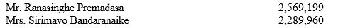
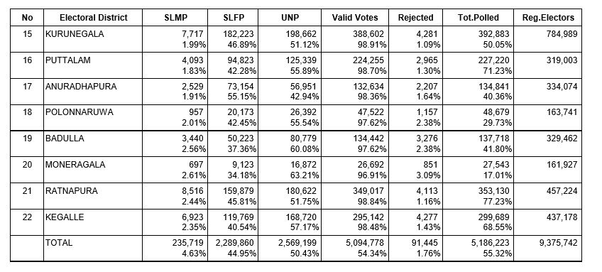
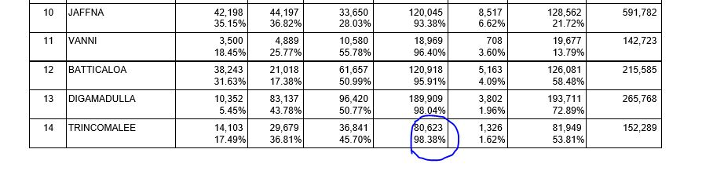
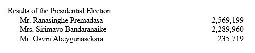
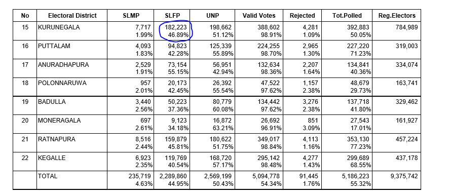
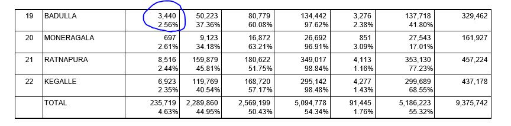

Election1988
================

# Structure of Document

Data extraction begins from page 4 of the document. Each page from here
has a table representing each district. All tables follow the similar
format.

If we consider the columns, first column is for candidate names with
other counts, second column and its consecutive columns are for
electorates. Final two columns are Postal Votes and Final District
Results.

Each cell has two numeric values which are number of votes and
percentages, this is true except for the last row. First 3 rows are for
candidates names, followed by Total No of Valid Votes, Total No of
Rejected Votes, Total No of votes polled and finally Total No of
Registered Electors.


# Process of Extraction

Each table has been extracted separately without any issues. Two inputs
are used, one is page number other is for special cases for several
districts. Two functions were created to extract two types of tables,
yet both of them look similar except a few anomalies

``` r
# load the pdf file
SL_PE_1988<-pdf_text("PresidentialElections1988.pdf")

# source the function
source("Extract1988.R")

# creating initial dataset Election1994
Election1988<-NULL

# special pages which has the same format 
pages<-c(6,16,17,24)

for (i in pages) 
    {
    Election1988[[i]]<-Extract_Type1_1988(i)
    }

    Election1988[[4]]<-Extract_Type1_1988(4,Colo = TRUE)

    Election1988[[5]]<-Extract_Type1_1988(5,Ga = TRUE)    

    Election1988[[8]]<-Extract_Type1_1988(8,Mat = TRUE)
    
    Election1988[[9]]<-Extract_Type1_1988(9,NE = TRUE)
    
    Election1988[[14]]<-Extract_Type1_1988(14,Van = TRUE)
    
    Election1988[[15]]<-Extract_Type1_1988(15,Bat = TRUE)
    
    Election1988[[19]]<-Extract_Type1_1988(19,Put = TRUE)
    
    Election1988[[21]]<-Extract_Type1_1988(21,Pol = TRUE)
    
    Election1988[[22]]<-Extract_Type1_1988(22,Ba = TRUE)
    
    Election1988[[23]]<-Extract_Type1_1988(23,Mon = TRUE)
    
    Election1988[[25]]<-Extract_Type1_1988(25,Ke = TRUE)

Election1988[[7]]<-Extract_Type2_1988(7,Ma=TRUE)
Election1988[[13]]<-Extract_Type2_1988(13,Ja=TRUE)
Election1988[[18]]<-Extract_Type2_1988(18,Ku=TRUE)
Election1988[[20]]<-Extract_Type2_1988(20,Anu=TRUE)

Election1988[[10]]<-Extract_Type2_1988(10,Ga=TRUE)
Election1988[[11]]<-Extract_Type2_1988(11,Mat=TRUE)
Election1988[[12]]<-Extract_Type2_1988(12,Ha=TRUE)

# final data set
Election1988<-do.call("rbind",Election1988)
```

# Validating Data Extracted

## Checking for Number of Registered Electors.

No issues here.



``` r
# Extracting only Final District District Results of 
# Number of Registered Electors
# and then adding all the votes 
ElecFinal1988<-subset(Election1988,Electorate=="Total" 
                      & ColNames=="No of Registered Electors")
# added votes will be cross checked with the pdf document
ElecFinal1988[,sum(Votes,na.rm = TRUE),by="ColNames"]
```

    ##                     ColNames      V1
    ## 1: No of Registered Electors 9375742

``` r
# Extracting except Final District District Results of 
# Number of Registered Electors
# and then adding all the votes 
ElecFinal1988<-subset(Election1988,Electorate!="Total" 
                      & ColNames=="No of Registered Electors")
# added votes will be cross checked with the pdf document
ElecFinal1988[,sum(Votes,na.rm = TRUE),by="ColNames"]
```

    ##                     ColNames      V1
    ## 1: No of Registered Electors 9375742

## Total Polled

54 votes are missing.


``` r
# Extracting only Final District District Results of 
# Total Polled
# and then adding all the votes 
ElecFinal1988<-subset(Election1988,Electorate=="Total" 
                      & ColNames=="Total No of Votes Polled")
# added votes will be cross checked with the pdf document
ElecFinal1988[,sum(Votes,na.rm = TRUE),by="ColNames"]
```

    ##                    ColNames      V1
    ## 1: Total No of Votes Polled 5186277

``` r
# Extracting except Final District District Results of 
# Total Polled
# and then adding all the votes 
ElecFinal1988<-subset(Election1988,Electorate!="Total" 
                      & ColNames=="Total No of Votes Polled")
# added votes will be cross checked with the pdf document
ElecFinal1988[,sum(Votes,na.rm = TRUE),by="ColNames"]
```

    ##                    ColNames      V1
    ## 1: Total No of Votes Polled 5186277

54 votes have been missed in the Gampaha district tallying. So if we
added those votes the final count will be as above. Total No of Votes
polled are 5186277.

``` r
ElecFinal1988<-subset(Election1988,Electorate!="Total" & District=="Gampaha" 
                      & ColNames=="Total No of Votes Polled")
ElecFinal1988[,sum(Votes,na.rm = TRUE),by="ColNames"]
```

    ##                    ColNames     V1
    ## 1: Total No of Votes Polled 738220

## Total Rejected

No issues here.



``` r
# Extracting only Final District District Results of 
# No of Rejected Votes
# and then adding all the votes 
ElecFinal1988<-subset(Election1988,Electorate=="Total" 
                      & ColNames=="No of Rejected Votes")
# added votes will be cross checked with the pdf document
ElecFinal1988[,sum(Votes,na.rm = TRUE),by="ColNames"]
```

    ##                ColNames    V1
    ## 1: No of Rejected Votes 91445

``` r
# Extracting except Final District District Results of 
# No of Rejected Votes
# and then adding all the votes 
ElecFinal1988<-subset(Election1988,Electorate!="Total" 
                      & ColNames=="No of Rejected Votes")
# added votes will be cross checked with the pdf document
ElecFinal1988[,sum(Votes,na.rm = TRUE),by="ColNames"]
```

    ##                ColNames    V1
    ## 1: No of Rejected Votes 91445

## Total Valid

Extra 3 votes added. Also it should be valid not valied.


``` r
# Extracting only Final District District Results of 
# Total No of Valied Votes
# and then adding all the votes 
ElecFinal1988<-subset(Election1988,Electorate=="Total" 
                      & ColNames=="Total No of Valied Votes")
# added votes will be cross checked with the pdf document
ElecFinal1988[,sum(Votes,na.rm = TRUE),by="ColNames"]
```

    ##                    ColNames      V1
    ## 1: Total No of Valied Votes 5094775

``` r
# Extracting except Final District District Results of 
# Total No of Valied Votes
# and then adding all the votes 
ElecFinal1988<-subset(Election1988,Electorate!="Total" 
                      & ColNames=="Total No of Valied Votes")
# added votes will be cross checked with the pdf document
ElecFinal1988[,sum(Votes,na.rm = TRUE),by="ColNames"]
```

    ##                    ColNames      V1
    ## 1: Total No of Valied Votes 5094775

Three votes are added extra in the district tally table. This is from
the Trincomalee district.

### Trincomalee District



``` r
ElecFinal1988<-subset(Election1988,Electorate!="Total" & District=="Trincomalee" 
                      & ColNames=="Total No of Valied Votes")
ElecFinal1988[,sum(Votes,na.rm = TRUE),by="ColNames"]
```

    ##                    ColNames    V1
    ## 1: Total No of Valied Votes 80620

So the final count for Total No of Valied Votes is 5094775.

## Comparing final tally votes of Mr. Ranasinghe Premadasa

No issues here.



``` r
# Extracting only Final District District Results of 
# Mr. Ranasinghe Premadasa
# and then adding all the votes 
ElecFinal1988<-subset(Election1988,Electorate=="Total" 
                      & ColNames=="Mr.Ranasinghe Premadasa")
# added votes will be cross checked with the pdf document
ElecFinal1988[,sum(Votes),by="ColNames"]
```

    ##                   ColNames      V1
    ## 1: Mr.Ranasinghe Premadasa 2569199

``` r
# Extracting except Final District District Results of 
# Mr. Ranasinghe Premadasa
# and then adding all the votes 
ElecFinal1988<-subset(Election1988,Electorate!="Total" 
                      & ColNames=="Mr.Ranasinghe Premadasa")
# added votes will be cross checked with the pdf document
ElecFinal1988[,sum(Votes,na.rm = TRUE),by="ColNames"]
```

    ##                   ColNames      V1
    ## 1: Mr.Ranasinghe Premadasa 2569199

## Comparing final tally votes of Mrs. Sirimavo Ratwatte Dias Bandaranaike

Extra 3 votes added and the below figure indicates the value 2289960 but
this not correct it should be 2289860(still mis calculated).


``` r
# Extracting only Final District District Results of 
# Mrs. Sirimavo Ratwatte Dias Bandaranaike
# and then adding all the votes 
ElecFinal1988<-subset(Election1988,Electorate=="Total" 
                      & ColNames=="Mrs.Sirimavo Ratwatte Dias Bandaranaike")
# added votes will be cross checked with the pdf document
ElecFinal1988[,sum(Votes),by="ColNames"]
```

    ##                                   ColNames      V1
    ## 1: Mrs.Sirimavo Ratwatte Dias Bandaranaike 2289857

``` r
# Extracting except Final District District Results of 
# Mrs. Sirimavo Ratwatte Dias Bandaranaike
# and then adding all the votes 
ElecFinal1988<-subset(Election1988,Electorate!="Total" 
                      & ColNames=="Mrs.Sirimavo Ratwatte Dias Bandaranaike")
# added votes will be cross checked with the pdf document
ElecFinal1988[,sum(Votes,na.rm = TRUE),by="ColNames"]
```

    ##                                   ColNames      V1
    ## 1: Mrs.Sirimavo Ratwatte Dias Bandaranaike 2289857

3 extra votes added in the district tally table. So the final count for
Mrs. Sirimavo Ratwatte Dias Bandaranaike is 2289857.



### Kurunegala District

``` r
ElecFinal1988<-subset(Election1988,Electorate!="Total" & District=="Kurunegala" 
                      & ColNames=="Mrs.Sirimavo Ratwatte Dias Bandaranaike")
ElecFinal1988[,sum(Votes,na.rm = TRUE),by="ColNames"]
```

    ##                                   ColNames     V1
    ## 1: Mrs.Sirimavo Ratwatte Dias Bandaranaike 182220

## Comparing final tally votes of Mr. Oswin Abeygunasekara

18 extra votes added.


``` r
# Extracting only Final District District Results of 
# Mr. Oswin Abeygunasekara
# and then adding all the votes 
ElecFinal1988<-subset(Election1988,Electorate=="Total" 
                      & ColNames=="Mr.Ahangama Vithanage Oswin Nandimitra Abhayagunasekara")
# added votes will be cross checked with the pdf document
ElecFinal1988[,sum(Votes),by="ColNames"]
```

    ##                                                   ColNames     V1
    ## 1: Mr.Ahangama Vithanage Oswin Nandimitra Abhayagunasekara 235701

``` r
# Extracting except Final District District Results of 
# Mr. Oswin Abeygunasekara
# and then adding all the votes 
ElecFinal1988<-subset(Election1988,Electorate!="Total" 
                      & ColNames=="Mr.Ahangama Vithanage Oswin Nandimitra Abhayagunasekara")
# added votes will be cross checked with the pdf document
ElecFinal1988[,sum(Votes,na.rm = TRUE),by="ColNames"]
```

    ##                                                   ColNames     V1
    ## 1: Mr.Ahangama Vithanage Oswin Nandimitra Abhayagunasekara 235701

18 extra votes added in the district tally table. So the final count for
Mr. Oswin Abhayagunasekara is 235701.



### Badulla District

``` r
ElecFinal1988<-subset(Election1988,Electorate!="Total" & District=="Badulla" 
                      & ColNames=="Mr.Ahangama Vithanage Oswin Nandimitra Abhayagunasekara")

ElecFinal1988[,sum(Votes,na.rm = TRUE),by="ColNames"]
```

    ##                                                   ColNames   V1
    ## 1: Mr.Ahangama Vithanage Oswin Nandimitra Abhayagunasekara 3422

*THANK YOU*
