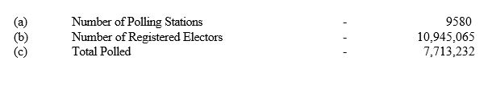

```{r setup, include=FALSE}
knitr::opts_chunk$set(echo = TRUE,warning = FALSE)

# Load the packages
library(data.table)
library(stringr)
library(splitstackshape)
library(pdftools)
```

# Structure of Document

Data extraction begins from page 4 of the document. Each page from here has a 
table representing  each district. All tables follow the similar format. 

If we consider the columns, first column is for candidate names with other counts,
second column and its consecutive columns are for electorates. Final two columns
are Postal Votes and Final District Results. 

Each cell has two numeric values which are number of votes and percentages, this is 
true except for the last row. First 6 rows are for candidates names, followed by 
No of Valid Votes, No of Rejected Votes, Total No of votes polled and finally
No of Registered Electors.


# Process of Extraction

Each table has been extracted separately without any issues. Two inputs are 
used, one is page number other is for special cases for several districts.

```{r Election 1994}
# load the pdf file
SL_PE_1994<-pdf_text("PresidentialElections1994.pdf")

# source the function
source("Extract1994.R")

# creating initial dataset Election1994
Election1994<-NULL

# chossing specific pages which does not have
# electorate name issues and scrapping them
for (i in c(6,9,11,12,14:19,21,23,24,25)) 
{
  Election1994[[i]]<-Extract_table1994(i)
}

# choosing specific pages which does have 
# electorate name issues and scrapping them
Election1994[[1]]<-Extract_table1994(8,NE=TRUE)
Election1994[[2]]<-Extract_table1994(4,Col=TRUE)
Election1994[[3]]<-Extract_table1994(5,Gam=TRUE)
Election1994[[4]]<-Extract_table1994(7,Ma=TRUE)
Election1994[[5]]<-Extract_table1994(13,Ja=TRUE)
Election1994[[7]]<-Extract_table1994(20,An=TRUE)
Election1994[[8]]<-Extract_table1994(22,Ba=TRUE)
Election1994[[10]]<-Extract_table1994(10,Ga=TRUE)

# final data set
Election1994<-do.call("rbind",Election1994)
```

# Validating Data Extracted

## Checking for Number of Registered Electors.



No issues here. 

```{r Reg Electors}
# Extracting only Final District District Results of 
# Number of Registered Electors
# and then adding all the votes 
ElecFinal1994<-subset(Election1994,Electorate=="Final District Results" 
                      & ColNames=="No of Registered Electors")
# added votes will be cross checked with the pdf document
ElecFinal1994[,sum(Votes),by="ColNames"]

# Extracting except Final District District Results of 
# Number of Registered Electors
# and then adding all the votes 
ElecFinal1994<-subset(Election1994,Electorate!="Final District Results" 
                      & Electorate!="Postal Votes"
                      & ColNames=="No of Registered Electors")
# added votes will be cross checked with the pdf document
ElecFinal1994[,sum(Votes),by="ColNames"]
```

## Checking for Total polled


No issues here.

```{r Tot Polled}
# Extracting only Final District District Results of 
# Total polled
# and then adding all the votes 
ElecFinal1994<-subset(Election1994,Electorate=="Final District Results" 
                      & ColNames=="Total No. of votes polled")
# added votes will be cross checked with the pdf document
ElecFinal1994[,sum(Votes),by="ColNames"]

# Extracting except Final District District Results of 
# Total polled
# and then adding all the votes 
ElecFinal1994<-subset(Election1994,Electorate!="Final District Results" 
                      & ColNames=="Total No. of votes polled")
# added votes will be cross checked with the pdf document
ElecFinal1994[,sum(Votes),by="ColNames"]
```

## Checking for Rejected Votes


No issues here.

```{r Rejected Votes}
# Extracting only Final District District Results of 
# No of Rejected votes
# and then adding all the votes 
ElecFinal1994<-subset(Election1994,Electorate=="Final District Results" 
                      & ColNames=="No of Rejected votes")
# added votes will be cross checked with the pdf document
ElecFinal1994[,sum(Votes),by="ColNames"]

# Extracting except Final District District Results of 
# No of Rejected votes
# and then adding all the votes 
ElecFinal1994<-subset(Election1994,Electorate!="Final District Results" 
                      & ColNames=="No of Rejected votes")
# added votes will be cross checked with the pdf document
ElecFinal1994[,sum(Votes,na.rm = TRUE),by="ColNames"]
```

## Checking for Valid Votes


No issues here.

```{r Valid Votes}
# Extracting only Final District District Results of 
# No of valid votes
# and then adding all the votes 
ElecFinal1994<-subset(Election1994,Electorate=="Final District Results" 
                      & ColNames=="No of valid votes")
# added votes will be cross checked with the pdf document
ElecFinal1994[,sum(Votes),by="ColNames"]

# Extracting except Final District District Results of 
# No of valid votes
# and then adding all the votes 
ElecFinal1994<-subset(Election1994,Electorate!="Final District Results" 
                      & ColNames=="No of valid votes")
# added votes will be cross checked with the pdf document
ElecFinal1994[,sum(Votes,na.rm = TRUE),by="ColNames"]
```

## Comparing final tally votes of Mrs. Chandrika Bandaranaike Kumarathunga 

No issues here.


```{r Validating the data 1}
# Extracting only Final District District Results of 
# Mrs. Chandrika Bandaranaike Kumarathunga
# and then adding all the votes 
ElecFinal1994<-subset(Election1994,Electorate=="Final District Results" 
                      & ColNames=="Mrs. Chandrika Bandaranaike Kumarathunga")
# added votes will be cross checked with the pdf document
ElecFinal1994[,sum(Votes),by="ColNames"]

# Extracting except Final District District Results of 
# Mrs. Chandrika Bandaranaike Kumarathunga
# and then adding all the votes 
ElecFinal1994<-subset(Election1994,Electorate!="Final District Results" 
                      & ColNames=="Mrs. Chandrika Bandaranaike Kumarathunga")
# added votes will be cross checked with the pdf document
ElecFinal1994[,sum(Votes),by="ColNames"]
```

## Comparing final tally votes of Mrs. Vajira Srimathi Disaanayake 

No issues here. It should be 2715283 but mistakenly printed as 
2715285.


```{r Vaildating the data 2}
# Extracting only Final District District Results of 
# Mrs. Vajira Srimathi Dissanayake
# and then adding all the votes 
ElecFinal1994<-subset(Election1994,Electorate=="Final District Results" 
                      & ColNames=="Mrs. Vajira Srimathi Dissanayake")
# added votes will be cross checked with the pdf document
ElecFinal1994[,sum(Votes),by="ColNames"]

# Extracting except Final District District Results of 
# Mrs. Vajira Srimathi Dissanayake
# and then adding all the votes 
ElecFinal1994<-subset(Election1994,Electorate!="Final District Results" 
                      & ColNames=="Mrs. Vajira Srimathi Dissanayake")
# added votes will be cross checked with the pdf document
ElecFinal1994[,sum(Votes,na.rm = TRUE),by="ColNames"]
```

## Comparing final tally votes of Mr.Galappaththi Arachchige 

No issues here.


```{r Vaildating the data 3}
# Extracting only Final District District Results of 
# Mr.Galappaththi Arachchige
# and then adding all the votes 
ElecFinal1994<-subset(Election1994,Electorate=="Final District Results" 
                      & ColNames=="Mr. Galappaththi Arachchige Nihal")
# added votes will be cross checked with the pdf document
ElecFinal1994[,sum(Votes),by="ColNames"]

# Extracting except Final District District Results of 
# Mr.Galappaththi Arachchige
# and then adding all the votes 
ElecFinal1994<-subset(Election1994,Electorate!="Final District Results" 
                      & ColNames=="Mr. Galappaththi Arachchige Nihal")
# added votes will be cross checked with the pdf document
ElecFinal1994[,sum(Votes,na.rm = TRUE),by="ColNames"]
```

## Comparing final tally votes of  Mr. A.J. Ranashinge 

No issues here.


```{r Vaildating the data 4}
# Extracting only Final District District Results of 
#  Mr. A.J. Ranashinge
# and then adding all the votes 
ElecFinal1994<-subset(Election1994,Electorate=="Final District Results" 
                      & ColNames=="Mr. A.J. Ranashinge")
# added votes will be cross checked with the pdf document
ElecFinal1994[,sum(Votes),by="ColNames"]

# Extracting except Final District District Results of 
#  Mr. A.J. Ranashinge
# and then adding all the votes 
ElecFinal1994<-subset(Election1994,Electorate!="Final District Results" 
                      & ColNames=="Mr. A.J. Ranashinge")
# added votes will be cross checked with the pdf document
ElecFinal1994[,sum(Votes,na.rm = TRUE),by="ColNames"]
```

## Comparing final tally votes of  Dr. Harischandra Wijayatunga

No issues here.


```{r Vaildating the data 5}
# Extracting only Final District District Results of 
#  Mr. A.J. Ranashinge
# and then adding all the votes 
ElecFinal1994<-subset(Election1994,Electorate=="Final District Results" 
                      & ColNames=="Dr. Harischandra Wijayatunga")
# added votes will be cross checked with the pdf document
ElecFinal1994[,sum(Votes),by="ColNames"]

# Extracting except Final District District Results of 
#   Dr. Harischandra Wijayatunga
# and then adding all the votes 
ElecFinal1994<-subset(Election1994,Electorate!="Final District Results" 
                      & ColNames=="Dr. Harischandra Wijayatunga")
# added votes will be cross checked with the pdf document
ElecFinal1994[,sum(Votes,na.rm = TRUE),by="ColNames"]
```

## Comparing final tally votes of  Mr. Hudson Samarasinghe 

According to Electorates tally it should be 58888, but mistakenly
calculated as 58886. This occurs because of the Batticaloa District
Tally.


```{r Vaildating the data 6}
# Extracting only Final District District Results of 
# Mr. Hudson Samarasinghe 
# and then adding all the votes 
ElecFinal1994<-subset(Election1994,Electorate=="Final District Results" 
                      & ColNames=="Mr. Hudson Samarasinghe")
# added votes will be cross checked with the pdf document
ElecFinal1994[,sum(Votes),by="ColNames"]

# Extracting except Final District District Results of 
# Mr. Hudson Samarasinghe 
# and then adding all the votes 
ElecFinal1994<-subset(Election1994,Electorate!="Final District Results" 
                      & ColNames=="Mr. Hudson Samarasinghe")
# added votes will be cross checked with the pdf document
ElecFinal1994[,sum(Votes,na.rm = TRUE),by="ColNames"]
```

The real tally for Batticaloa district is 5030 but mis calculated
as 5028. So the Final Count for Mr. Hudson Samarasinghe is 58888.


### Batticaloa district

```{r Batticaloa District}
ElecFinal1994<-subset(Election1994,Electorate!="Final District Results"
                      & District=="Batticaloa"
                      & ColNames=="Mr. Hudson Samarasinghe")
ElecFinal1994[,sum(Votes,na.rm = TRUE),by="ColNames"]
```


*THANK YOU*