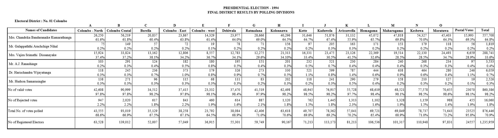
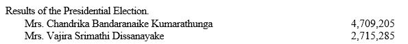

Election1994
================

# Structure of Document

Data extraction begins from page 4 of the document. Each page from here
has a table representing each disttrict. All tables follow the similar
format.

If we consider the columns, first column is for candidate names with
other counts, second column and its consecutive columns are for
electorates. Final two columns are Postal Votes and Final District
Results.

Each cell has two numeric values which are number of votes and
percentages, this is true except for the last row. First 6 rows are for
candidates names, follwed by No of Valid Votes, No of Rejected Votes,
Total No of votes polled and finally No of Registered Electors.



# Process of Extraction

Each table has been extracted seprately without any issues.

``` r
# load the pdf file
SL_PE_1994<-pdf_text("PresidentialElections1994.pdf")

# source the function
source("Extract1994.R")

# creating initial dataset Election1994
Election1994<-NULL

# chossing specific pages which does not have
# electorate name issues and scrapping them
for (i in c(6,9,11,12,14:19,21,23,24,25)) 
{
  Election1994[[i]]<-Extract_table1994(i)
}

# choosing specific pages which does have 
# electorate name issues and scrapping them
Election1994[[1]]<-Extract_table1994(8,NE=TRUE)
Election1994[[2]]<-Extract_table1994(4,Col=TRUE)
Election1994[[3]]<-Extract_table1994(5,Gam=TRUE)
Election1994[[4]]<-Extract_table1994(7,Ma=TRUE)
Election1994[[5]]<-Extract_table1994(13,Ja=TRUE)
Election1994[[7]]<-Extract_table1994(20,An=TRUE)
Election1994[[8]]<-Extract_table1994(22,Ba=TRUE)
Election1994[[10]]<-Extract_table1994(10,Ga=TRUE)

# final data set
Election1994<-do.call("rbind",Election1994)
```

# Validating Data Extracted

Checking for Number of Registered Electors.

``` r
# Extracting only Final District District Results of 
# Number of Registered Electors
# and then adding all the votes 
ElecFinal1994<-subset(Election1994,Electorate=="Final District Results" 
                      & ColNames=="No of Registered Electors")
# added votes will be cross checked with the pdf document
ElecFinal1994[,sum(Votes),by="ColNames"]
```

    ##                     ColNames       V1
    ## 1: No of Registered Electors 10945065

``` r
# Extracting except Final District District Results of 
# Number of Registered Electors
# and then adding all the votes 
ElecFinal1994<-subset(Election1994,Electorate!="Final District Results" 
                      & Electorate!="Postal Votes"
                      & ColNames=="No of Registered Electors")
# added votes will be cross checked with the pdf document
ElecFinal1994[,sum(Votes),by="ColNames"]
```

    ##                     ColNames       V1
    ## 1: No of Registered Electors 10945065

Comparing final tally votes of Mrs. Chandrika Bandaranaike Kumarathunga
from the pdf file to the data extracted as below.



``` r
# Extracting only Final District District Results of 
# Mrs. Chandrika Bandaranaike Kumarathunga
# and then adding all the votes 
ElecFinal1994<-subset(Election1994,Electorate=="Final District Results" 
                      & ColNames=="Mrs. Chandrika Bandaranaike Kumarathunga")
# added votes will be cross checked with the pdf document
ElecFinal1994[,sum(Votes),by="ColNames"]
```

    ##                                    ColNames      V1
    ## 1: Mrs. Chandrika Bandaranaike Kumarathunga 4709205

``` r
# Extracting except Final District District Results of 
# Mrs. Chandrika Bandaranaike Kumarathunga
# and then adding all the votes 
ElecFinal1994<-subset(Election1994,Electorate!="Final District Results" 
                      & ColNames=="Mrs. Chandrika Bandaranaike Kumarathunga")
# added votes will be cross checked with the pdf document
ElecFinal1994[,sum(Votes),by="ColNames"]
```

    ##                                    ColNames      V1
    ## 1: Mrs. Chandrika Bandaranaike Kumarathunga 4709205

It seems data extraction is successful.

Similarly comparing final tally votes of Mrs. Wajira Srimathi
Disaanayake from the pdf file to the data extracted as below.


``` r
# Extracting only Final District District Results of 
# Mrs. Vajira Srimathi Dissanayake
# and then adding all the votes 
ElecFinal1994<-subset(Election1994,Electorate=="Final District Results" 
                      & ColNames=="Mrs. Vajira Srimathi Dissanayake")
# added votes will be cross checked with the pdf document
ElecFinal1994[,sum(Votes),by="ColNames"]
```

    ##                            ColNames      V1
    ## 1: Mrs. Vajira Srimathi Dissanayake 2715283

``` r
# Extracting except Final District District Results of 
# Mrs. Vajira Srimathi Dissanayake
# and then adding all the votes 
ElecFinal1994<-subset(Election1994,Electorate!="Final District Results" 
                      & ColNames=="Mrs. Vajira Srimathi Dissanayake")
# added votes will be cross checked with the pdf document
ElecFinal1994[,sum(Votes,na.rm = TRUE),by="ColNames"]
```

    ##                            ColNames      V1
    ## 1: Mrs. Vajira Srimathi Dissanayake 2715283

According to the above summation the tally is 2715283 which is different
from the pdf file. The difference is 2 votes. Does that mean their tally
is ……\! .

*THANK YOU*
