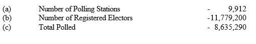

Year 1999
================

# Structure of Document

Data extraction begins from page 4 of the document. Each page from here
has a table representing each disttrict. All tables follow the similar
format.

Each cell has two numeric values which are number of votes and
percentages, this is true except for the first column. First column is
for electorates, next is for registered electors. After that we have 14
columns which are for candidates names, follwed by Valid Votes, Rejected
Votes and finally Total polled.


# Process of Extraction

Each table has been extracted separately without any issues. Three
inputs are used the first is page number, second is number of rows rows
in the table (except heading). There is one special case which is for
Gampaha district.

``` r
# load the pdf file
SL_PE_1999<-pdf_text("PresidentialElections1999.pdf")

# source the function
source("Extract1999.R")

# creating initial dataset Election1999
Election1999<-NULL

# extracting Colombo district table
Election1999[[1]]<-Extract_table1999(5,17)

# extracting Gamapaha district table
Election1999[[2]]<-Extract_table1999(6,15,GA=TRUE)

# extracting Kalutara district table
Election1999[[3]]<-Extract_table1999(7,10)

# extracting Mahanuwara district table
Election1999[[4]]<-Extract_table1999(8,15)

# extracting Matale district table
Election1999[[5]]<-Extract_table1999(9,6)

# extracting Nuwara-Eliya district table
Election1999[[6]]<-Extract_table1999(10,6)

# extracting Galle district table
Election1999[[7]]<-Extract_table1999(11,12)

# extracting Matara district table
Election1999[[8]]<-Extract_table1999(12,9)

# extracting Hambantota district table
Election1999[[9]]<-Extract_table1999(13,6)

# extracting Jaffna district table
Election1999[[10]]<-Extract_table1999(14,13)

# extracting Vanni district table
Election1999[[11]]<-Extract_table1999(15,5)

# extracting Batticaloa district table
Election1999[[12]]<-Extract_table1999(16,5)

# extracting Trincomalee district table
Election1999[[13]]<-Extract_table1999(17,5)

# extracting Digamadulla district table
Election1999[[14]]<-Extract_table1999(18,6)

# extracting Kurunegala district table
Election1999[[15]]<-Extract_table1999(19,16)

# extracting puttalam district table
Election1999[[16]]<-Extract_table1999(20,7)

# extracting Anuradhapura district table
Election1999[[17]]<-Extract_table1999(21,9)

# extracting Polonnaruwa district table
Election1999[[18]]<-Extract_table1999(22,5)

# extracting Badulla district table
Election1999[[19]]<-Extract_table1999(23,11)

# extracting Moneragala district table
Election1999[[20]]<-Extract_table1999(24,5)

# extracting Ratnapura district table
Election1999[[21]]<-Extract_table1999(25,10)

# extracting Kegalle district table
Election1999[[22]]<-Extract_table1999(26,11)

# final data set
Election1999<-do.call("rbind",Election1999)
```

# Validating Data extracted

Checking for Number of Registered Electors.

``` r
# Extracting only Final District District Results of 
# Number of Registered Electors
# and then adding all the votes 
ElecFinal1999<-subset(Election1999,Electorate=="FINAL DISTRICT RESULTS" 
                      & ColNames=="Registered Electors")
# added votes will be cross checked with the pdf document
ElecFinal1999[,sum(Votes),by="ColNames"]
```

    ##               ColNames       V1
    ## 1: Registered Electors 11779200

``` r
# Extracting except Final District District Results of 
# Number of Registered Electors
# and then adding all the votes 
ElecFinal1999<-subset(Election1999,Electorate!="FINAL DISTRICT RESULTS" 
                      & Electorate!="POSTAL VOTES"
                      & ColNames=="Registered Electors")
# added votes will be cross checked with the pdf document
ElecFinal1999[,sum(Votes),by="ColNames"]
```

    ##               ColNames       V1
    ## 1: Registered Electors 11779200

Comparing final tally votes of Mrs. Chandrika Bandaranaike Kumarathunga
or the candidate from PA from the pdf file to the data extracted as
below.



``` r
# Extracting only Final District District Results of 
# Mrs. Chandrika Bandaranaike Kumarathunga
# and then adding all the votes 
ElecFinal1999<-subset(Election1999,Electorate=="FINAL DISTRICT RESULTS" 
                      & ColNames=="PA")
# added votes will be cross checked with the pdf document
ElecFinal1999[,sum(Votes),by="ColNames"]
```

    ##    ColNames      V1
    ## 1:       PA 4312157

``` r
# Extracting except Final District District Results of 
# Mrs. Chandrika Bandaranaike Kumarathunga
# and then adding all the votes 
ElecFinal1999<-subset(Election1999,Electorate!="FINAL DISTRICT RESULTS" 
                      & ColNames=="PA")
# added votes will be cross checked with the pdf document
ElecFinal1999[,sum(Votes),by="ColNames"]
```

    ##    ColNames      V1
    ## 1:       PA 4312157

It seems data extraction is successful.

Similarly comparing final tally votes of Mr. Ranil Wickremasinghe  
from the pdf file to the data extracted as below.


``` r
# Extracting only Final District District Results of 
#  Mr. Ranil Wickremasinghe 
# and then adding all the votes 
ElecFinal1999<-subset(Election1999,Electorate=="FINAL DISTRICT RESULTS" 
                      & ColNames=="UNP")
# added votes will be cross checked with the pdf document
ElecFinal1999[,sum(Votes),by="ColNames"]
```

    ##    ColNames      V1
    ## 1:      UNP 3602748

``` r
# Extracting except Final District District Results of 
#  Mr. Ranil Wickremasinghe 
# and then adding all the votes 
ElecFinal1999<-subset(Election1999,Electorate!="FINAL DISTRICT RESULTS" 
                      & ColNames=="UNP")
# added votes will be cross checked with the pdf document
ElecFinal1999[,sum(Votes),by="ColNames"]
```

    ##    ColNames      V1
    ## 1:      UNP 3602748

It seems data extraction is successful.

*THANK YOU*
