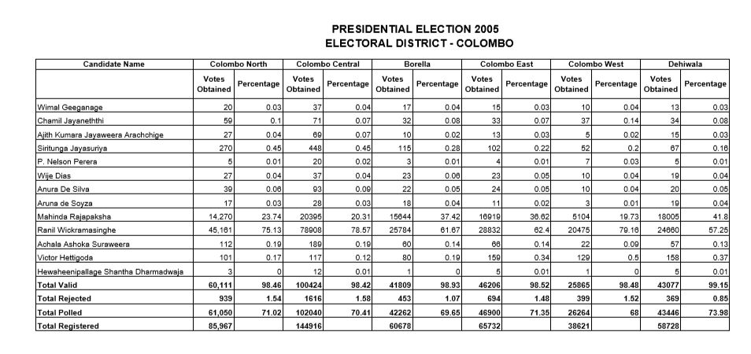
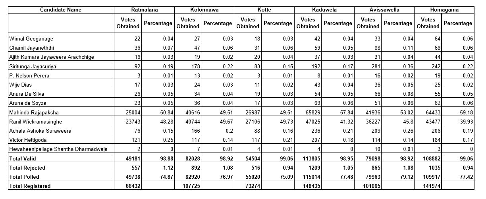
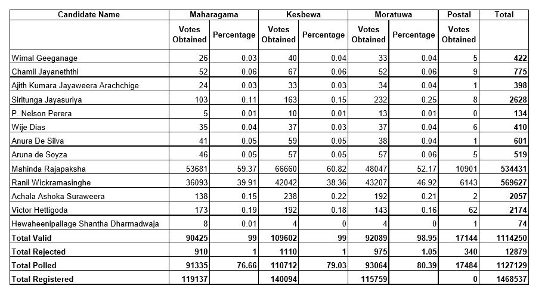
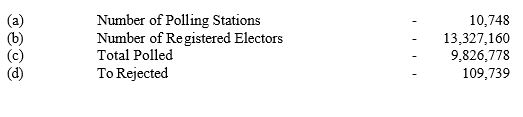
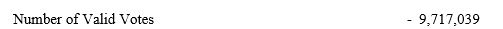
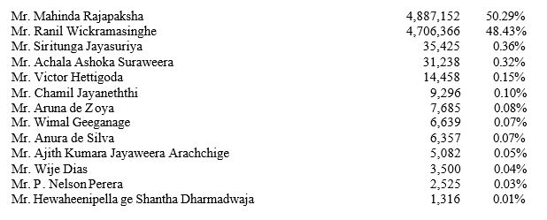

```{r setup, include=FALSE}
knitr::opts_chunk$set(echo = TRUE,warning = FALSE)
library(data.table)
library(stringr)
library(splitstackshape)
library(pdftools)
```

# Structure of Document

Data extraction begins from page 1 of the document. There are two situations, 
one is where each district result is spread through more than one page(maximum 
three pages), next is a district result is in only one page.

Each cell has one value, which is votes or percentages but depends on the column. 
First column has candidate names(13 names) followed by total valid, total rejected, total 
polled and finally total registered. The first column is similar to all pages which are
followed by electorates Votes obtained and percentage, Finally ends with Postal votes
and Total Votes.

When a result of the district begins we know which district it is for based on the heading, 
but this is not the case for consecutive pages. Based on this condition I have developed
two functions. Also number of columns in tables change is considered as well.





# Process of Extraction

Each table has been separated based on if it has District name, number of columns and 
does it has Postal votes, Total votes and Displaced votes.

```{r Election 2005}
# load the pdf file
SL_PE_2005<-pdf_text("PresidentialElections2005(district).pdf")

# source the function
source("Extract2005.R")

# creating initial dataset Election2005
Election2005<-NULL

# extracting Colombo district tables
Election2005[[1]]<-Extract_Inittable2005(page=1,nc=6,colo=TRUE)
Election2005[[2]]<-Extract_othertable2005(page=2,District="COLOMBO",nc=6,other = FALSE)     
Election2005[[3]]<-Extract_othertable2005(page=3,District = "COLOMBO",nc=5)

# extracting Gampaha district tables
Election2005[[4]]<-Extract_Inittable2005(page=4,nc=6)
Election2005[[5]]<-Extract_othertable2005(page=5,District="GAMPAHA",nc=6,other = FALSE)     
Election2005[[6]]<-Extract_othertable2005(page=6,District="GAMPAHA",nc=3)

# extracting Kalutara district tables
Election2005[[7]]<-Extract_Inittable2005(page=7,nc=6)
Election2005[[8]]<-Extract_othertable2005(page=8,District = "KALUTARA",nc=4) 

# extracting Kandy district tables
Election2005[[9]]<-Extract_Inittable2005(page=9,nc=6)
Election2005[[10]]<-Extract_othertable2005(page=10,District = "MAHANUWARA",nc=6,other = FALSE)     
Election2005[[11]]<-Extract_othertable2005(page=11,District = "MAHANUWARA",nc=3)

# extracting Matale district table
Election2005[[12]]<-Extract_Inittable2005(page=12,nc=6,other = TRUE)

# extracting Nuwara-Eliya district table
Election2005[[13]]<-Extract_Inittable2005(page=13,nc=6,other = TRUE,NE=TRUE)

# extracting Galle district tables
Election2005[[14]]<-Extract_Inittable2005(page=14,nc=6)
Election2005[[15]]<-Extract_othertable2005(page=15,District = "GALLE",nc=6)     

# extracting Matara district tables
Election2005[[16]]<-Extract_Inittable2005(page=16,nc=6)
Election2005[[17]]<-Extract_othertable2005(page=17,District="MATARA",nc=3)

# extracting Hambantota district table
Election2005[[18]]<-Extract_Inittable2005(page=18,nc=6,other = TRUE)

# extracting Jaffna district tables
Election2005[[19]]<-Extract_Inittable2005(page=19,nc=6,jaff = TRUE)
Election2005[[20]]<-Extract_othertable2005(page=20,District = "JAFFNA",nc=8,dis = TRUE,jaff=TRUE)

# extracting Vanni district table
Election2005[[21]]<-Extract_Inittable2005(page=21,nc=6,other = TRUE,dis = TRUE)

# extracting Batticaloa district table
Election2005[[22]]<-Extract_Inittable2005(page=22,nc=5,other=TRUE)

# extracting Ampara /Digamadulla table
Election2005[[23]]<-Extract_Inittable2005(page=23,nc=6,other = TRUE,amp = TRUE)

# extracting Trincomalee district table
Election2005[[24]]<-Extract_Inittable2005(page=24,nc=6,other=TRUE,dis=TRUE)

# extracting Kurunegala district tables
Election2005[[25]]<-Extract_Inittable2005(page=25,nc=5)
Election2005[[26]]<-Extract_othertable2005(page=26,District = "KURUNEGALA",nc=5,other = FALSE)     
Election2005[[27]]<-Extract_othertable2005(page=27,District = "KURUNEGALA",nc=6)

# extracting Puttalam district table
Election2005[[28]]<-Extract_Inittable2005(page=28,nc=7,other=TRUE)

# extracting Anuradhapura district tables
Election2005[[29]]<-Extract_Inittable2005(page=29,nc=5,anu = TRUE)
Election2005[[30]]<-Extract_othertable2005(page=30,District = "ANURADHAPURA",nc=4)     

# extracting Polonnaruwa district table
Election2005[[31]]<-Extract_Inittable2005(page=31,nc=5,other=TRUE)

# extracting Badulla district tables
Election2005[[32]]<-Extract_Inittable2005(page=32,nc=5)
Election2005[[33]]<-Extract_othertable2005(page=33,District = "BADULLA",nc=6)     

# extracting Monaragala district table
Election2005[[34]]<-Extract_Inittable2005(page=34,nc=5,other = TRUE)

# extracting Ratnapura district tables
Election2005[[35]]<-Extract_Inittable2005(page=35,nc=6)
Election2005[[36]]<-Extract_othertable2005(page=36,District = "RATNAPURA",nc=4)

# extracting Kegalle district tables
Election2005[[37]]<-Extract_Inittable2005(page=37,nc=6)
Election2005[[38]]<-Extract_othertable2005(page=38,District = "KEGALLE",nc=5)     

# Final table
Election2005<-do.call("rbind",Election2005)
```

# Validating Data extracted

## Checking for Number of Registered Electors.

No issues here.



```{r Reg Electors}
# Extracting only Final District District Results of 
# Number of Registered Electors
# and then adding all the votes 
ElecFinal2005<-subset(Election2005,Electorate=="Total" 
                      & ColNames=="Total Registered")
# added votes will be cross checked with the pdf document
ElecFinal2005[,sum(Votes),by="ColNames"]

# Extracting except Final District District Results of 
# Number of Registered Electors
# and then adding all the votes 
ElecFinal2005<-subset(Election2005,Electorate!="Total" 
                      & Electorate!="Postal"
                      & ColNames=="Total Registered")
# added votes will be cross checked with the pdf document
ElecFinal2005[,sum(Votes),by="ColNames"]
```

## Checking for Total Polled.


```{r Total Polled}
# Extracting only Final District District Results of 
# Total Polled
# and then adding all the votes 
ElecFinal2005<-subset(Election2005,Electorate=="Total" 
                      & ColNames=="Total Polled")
# added votes will be cross checked with the pdf document
ElecFinal2005[,sum(Votes),by="ColNames"]

# Extracting except Final District District Results of 
# Total Polled
# and then adding all the votes 
ElecFinal2005<-subset(Election2005,Electorate!="Total" 
                      & ColNames=="Total Polled")
# added votes will be cross checked with the pdf document
ElecFinal2005[,sum(Votes),by="ColNames"]
```

## Checking for Total Rejected.


```{r Total Rejected}
# Extracting only Final District District Results of 
# Total Rejected
# and then adding all the votes 
ElecFinal2005<-subset(Election2005,Electorate=="Total" 
                      & ColNames=="Total Rejected")
# added votes will be cross checked with the pdf document
ElecFinal2005[,sum(Votes),by="ColNames"]

# Extracting except Final District District Results of 
# Total Rejected
# and then adding all the votes 
ElecFinal2005<-subset(Election2005,Electorate!="Total" 
                      & ColNames=="Total Rejected")
# added votes will be cross checked with the pdf document
ElecFinal2005[,sum(Votes),by="ColNames"]
```

## Checking for Total Valid.



No issues here.

```{r Total Valid}
# Extracting only Final District District Results of 
# Total Valid
# and then adding all the votes 
ElecFinal2005<-subset(Election2005,Electorate=="Total" 
                      & ColNames=="Total Valid")
# added votes will be cross checked with the pdf document
ElecFinal2005[,sum(Votes),by="ColNames"]

# Extracting except Final District District Results of 
# Total Valid
# and then adding all the votes 
ElecFinal2005<-subset(Election2005,Electorate!="Total" 
                      & ColNames=="Total Valid")
# added votes will be cross checked with the pdf document
ElecFinal2005[,sum(Votes),by="ColNames"]
```

## Comparing final tally votes of Mr. Mahinda Rajapaksa

No issues here.



```{r Validating the data 1}
# Extracting only Final District District Results of 
# Mr. Mahinda Rajapaksa
# and then adding all the votes 
ElecFinal2005<-subset(Election2005,Electorate=="Total" 
                      & ColNames=="Mahinda Rajapaksha")
# added votes will be cross checked with the pdf document
ElecFinal2005[,sum(Votes),by="ColNames"]

# Extracting except Final District District Results of 
# Mr. Mahinda Rajapaksa
# and then adding all the votes 
ElecFinal2005<-subset(Election2005,Electorate!="Total" 
                      & ColNames=="Mahinda Rajapaksha")
# added votes will be cross checked with the pdf document
ElecFinal2005[,sum(Votes),by="ColNames"]
```


## Comparing final tally votes of  Mr. Ranil Wickremasinghe  

No issues here.


```{r Vaildating the data 2}
# Extracting only Final District District Results of 
#  Mr. Ranil Wickremasinghe 
# and then adding all the votes 
ElecFinal2005<-subset(Election2005,Electorate=="Total" 
                      & ColNames=="Ranil Wickramasinghe")
# added votes will be cross checked with the pdf document
ElecFinal2005[,sum(Votes),by="ColNames"]

# Extracting except Final District District Results of 
#  Mr. Ranil Wickremasinghe 
# and then adding all the votes 
ElecFinal2005<-subset(Election2005,Electorate!="Total" 
                      & ColNames=="Ranil Wickramasinghe")
# added votes will be cross checked with the pdf document
ElecFinal2005[,sum(Votes),by="ColNames"]
```

## Comparing final tally votes of   Mr. Siritunga Jayasuriya   

No issues here.


```{r Vaildating the data 3}
# Extracting only Final District District Results of 
#  Mr. Siritunga Jayasuriya 
# and then adding all the votes 
ElecFinal2005<-subset(Election2005,Electorate=="Total" 
                      & ColNames=="Siritunga Jayasuriya")
# added votes will be cross checked with the pdf document
ElecFinal2005[,sum(Votes),by="ColNames"]

# Extracting except Final District District Results of 
#  Mr. Siritunga Jayasuriya 
# and then adding all the votes 
ElecFinal2005<-subset(Election2005,Electorate!="Total" 
                      & ColNames=="Siritunga Jayasuriya")
# added votes will be cross checked with the pdf document
ElecFinal2005[,sum(Votes),by="ColNames"]
```

## Comparing final tally votes of  Mr. Achala Ashoka Suraweera    

No issues here.


```{r Vaildating the data 4}
# Extracting only Final District District Results of 
#  Mr. Achala Ashoka Suraweera   
# and then adding all the votes 
ElecFinal2005<-subset(Election2005,Electorate=="Total" 
                      & ColNames=="Achala Ashoka Suraweera")
# added votes will be cross checked with the pdf document
ElecFinal2005[,sum(Votes),by="ColNames"]

# Extracting except Final District District Results of 
#  Mr. Achala Ashoka Suraweera  
# and then adding all the votes 
ElecFinal2005<-subset(Election2005,Electorate!="Total" 
                      & ColNames=="Achala Ashoka Suraweera")
# added votes will be cross checked with the pdf document
ElecFinal2005[,sum(Votes),by="ColNames"]
```

## Comparing final tally votes of  Mr. Victor Hettigoda     

No issues here.


```{r Vaildating the data 5}
# Extracting only Final District District Results of 
# Mr. Victor Hettigoda    
# and then adding all the votes 
ElecFinal2005<-subset(Election2005,Electorate=="Total" 
                      & ColNames=="Victor Hettigoda")
# added votes will be cross checked with the pdf document
ElecFinal2005[,sum(Votes),by="ColNames"]

# Extracting except Final District District Results of 
# Mr. Victor Hettigoda  
# and then adding all the votes 
ElecFinal2005<-subset(Election2005,Electorate!="Total" 
                      & ColNames=="Victor Hettigoda")
# added votes will be cross checked with the pdf document
ElecFinal2005[,sum(Votes),by="ColNames"]
```

## Comparing final tally votes of Mr. Chamil Jayaneththi      

No issues here.


```{r Vaildating the data 6}
# Extracting only Final District District Results of 
# Mr. Chamil Jayaneththi    
# and then adding all the votes 
ElecFinal2005<-subset(Election2005,Electorate=="Total" 
                      & ColNames=="Chamil Jayaneththi")
# added votes will be cross checked with the pdf document
ElecFinal2005[,sum(Votes),by="ColNames"]

# Extracting except Final District District Results of 
# Mr. Chamil Jayaneththi   
# and then adding all the votes 
ElecFinal2005<-subset(Election2005,Electorate!="Total" 
                      & ColNames=="Chamil Jayaneththi")
# added votes will be cross checked with the pdf document
ElecFinal2005[,sum(Votes),by="ColNames"]
```

## Comparing final tally votes of Mr. Aruna de Soyza       

No issues here.


```{r Vaildating the data 7}
# Extracting only Final District District Results of 
# Mr. Aruna de Zoya     
# and then adding all the votes 
ElecFinal2005<-subset(Election2005,Electorate=="Total" 
                      & ColNames=="Aruna de Soyza" |
                      Electorate=="Total" 
                      & ColNames=="Aruna De Soyza")
# added votes will be cross checked with the pdf document
ElecFinal2005[,sum(Votes),by="ColNames"]

# Extracting except Final District District Results of 
# Mr. Aruna de Zoya    
# and then adding all the votes 
ElecFinal2005<-subset(Election2005,Electorate!="Total" 
                      & ColNames=="Aruna de Soyza"|
                      Electorate=="Total" 
                      & ColNames=="Aruna De Soyza")
# added votes will be cross checked with the pdf document
ElecFinal2005[,sum(Votes),by="ColNames"]
```

## Comparing final tally votes of Mr. Wimal Geeganage       

No issues here.


```{r Vaildating the data 8}
# Extracting only Final District District Results of 
# Mr. Wimal Geeganage    
# and then adding all the votes 
ElecFinal2005<-subset(Election2005,Electorate=="Total" 
                      & ColNames=="Wimal Geeganage")
# added votes will be cross checked with the pdf document
ElecFinal2005[,sum(Votes),by="ColNames"]

# Extracting except Final District District Results of 
# Mr. Wimal Geeganage    
# and then adding all the votes 
ElecFinal2005<-subset(Election2005,Electorate!="Total" 
                      & ColNames=="Wimal Geeganage")
# added votes will be cross checked with the pdf document
ElecFinal2005[,sum(Votes),by="ColNames"]
```

## Comparing final tally votes of Mr. Anura De Silva        

No issues here.


```{r Vaildating the data 9}
# Extracting only Final District District Results of 
# Mr. Anura de Silva     
# and then adding all the votes 
ElecFinal2005<-subset(Election2005,Electorate=="Total" 
                      & ColNames=="Anura De Silva")
# added votes will be cross checked with the pdf document
ElecFinal2005[,sum(Votes),by="ColNames"]

# Extracting except Final District District Results of 
# Mr. Anura de Silva    
# and then adding all the votes 
ElecFinal2005<-subset(Election2005,Electorate!="Total" 
                      & ColNames=="Anura De Silva")
# added votes will be cross checked with the pdf document
ElecFinal2005[,sum(Votes),by="ColNames"]
```

## Comparing final tally votes of Mr. Ajith Kumara Jayaweera Arachchige         

No issues here.


```{r Vaildating the data 10}
# Extracting only Final District District Results of 
# Mr. Ajith Kumara Jayaweera Arachchige      
# and then adding all the votes 
ElecFinal2005<-subset(Election2005,Electorate=="Total" 
                      & ColNames=="Ajith Kumara Jayaweera Arachchige")
# added votes will be cross checked with the pdf document
ElecFinal2005[,sum(Votes),by="ColNames"]

# Extracting except Final District District Results of 
# Mr. Ajith Kumara Jayaweera Arachchige    
# and then adding all the votes 
ElecFinal2005<-subset(Election2005,Electorate!="Total" 
                      & ColNames=="Ajith Kumara Jayaweera Arachchige")
# added votes will be cross checked with the pdf document
ElecFinal2005[,sum(Votes),by="ColNames"]
```

## Comparing final tally votes of Mr. Wije Dias          

No issues here.


```{r Vaildating the data 11}
# Extracting only Final District District Results of 
# Mr. Wije Dias       
# and then adding all the votes 
ElecFinal2005<-subset(Election2005,Electorate=="Total" 
                      & ColNames=="Wije Dias")
# added votes will be cross checked with the pdf document
ElecFinal2005[,sum(Votes),by="ColNames"]

# Extracting except Final District District Results of 
# Mr. Wije Dias     
# and then adding all the votes 
ElecFinal2005<-subset(Election2005,Electorate!="Total" 
                      & ColNames=="Wije Dias")
# added votes will be cross checked with the pdf document
ElecFinal2005[,sum(Votes),by="ColNames"]
```

## Comparing final tally votes of Mr. P. Nelson Perera          

No issues here.


```{r Vaildating the data 12}
# Extracting only Final District District Results of 
# Mr. P. Nelson Perera       
# and then adding all the votes 
ElecFinal2005<-subset(Election2005,Electorate=="Total" 
                      & ColNames=="P. Nelson Perera")
# added votes will be cross checked with the pdf document
ElecFinal2005[,sum(Votes),by="ColNames"]

# Extracting except Final District District Results of 
# Mr. P. Nelson Perera     
# and then adding all the votes 
ElecFinal2005<-subset(Election2005,Electorate!="Total" 
                      & ColNames=="P. Nelson Perera")
# added votes will be cross checked with the pdf document
ElecFinal2005[,sum(Votes),by="ColNames"]
```

## Comparing final tally votes of Mr. Hewaheenipellage Shantha Dharmadwaja           

No issues here.


```{r Vaildating the data 13}
# Extracting only Final District District Results of 
# Mr. Hewaheenipellage Shantha Dharmadwaja        
# and then adding all the votes 
ElecFinal2005<-subset(Election2005,Electorate=="Total" 
                      & ColNames=="Hewaheenipallage Shantha Dharmadwaja")
# added votes will be cross checked with the pdf document
ElecFinal2005[,sum(Votes),by="ColNames"]

# Extracting except Final District District Results of 
# Mr. Hewaheenipellage Shantha Dharmadwaja      
# and then adding all the votes 
ElecFinal2005<-subset(Election2005,Electorate!="Total" 
                      & ColNames=="Hewaheenipallage Shantha Dharmadwaja")
# added votes will be cross checked with the pdf document
ElecFinal2005[,sum(Votes),by="ColNames"]
```

*THANK YOU*