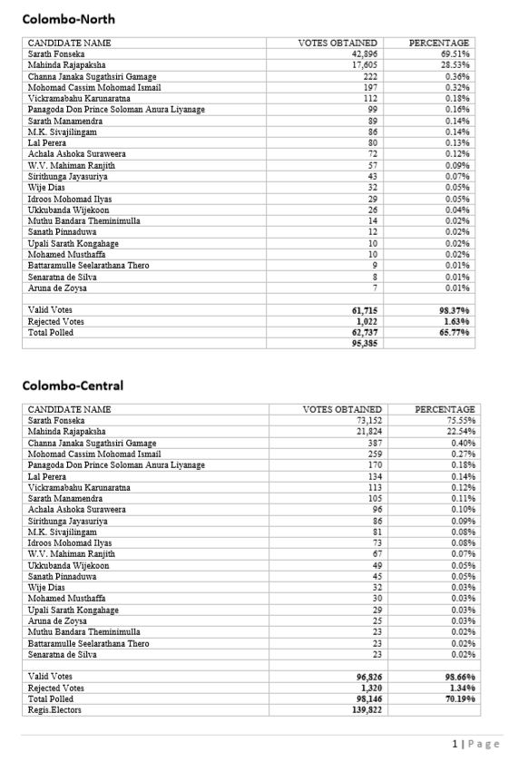
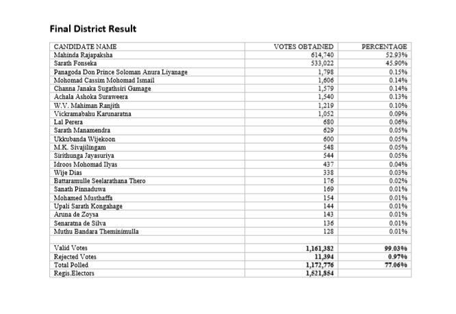
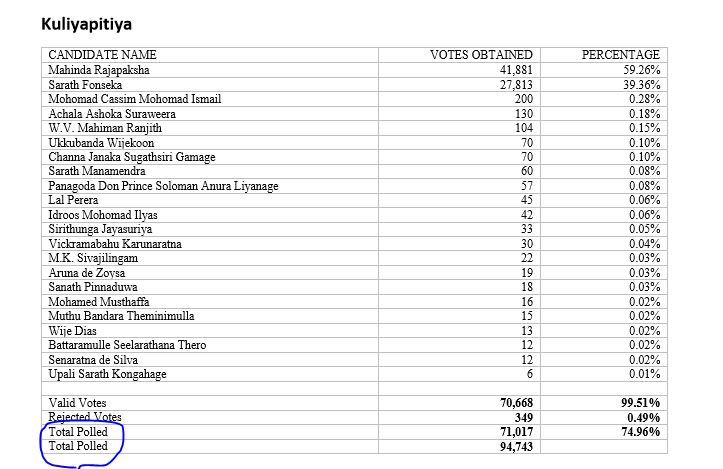

```{r setup, include=FALSE}
knitr::opts_chunk$set(echo = TRUE,warning = FALSE)
library(data.table)
library(stringr)
library(splitstackshape)
library(pdftools)
```

# Structure of Document

Data extraction begins from page 2 of the document. There are two situations, 
one is where there are two tables in a page and other is where one table in a page.
Each cell has one value, which is votes or percentages depending on the column.

First Column is for Candidates names followed by Valid votes, Rejected votes and 
Total polled. Each district begins in a new page. It should be noted that the district
for respective electorates are not mentioned above any table or page.




# Process of Extraction

Based on number of tables in a page data is extracted. Inputs are page number and
District name. Each district data has been extracted.

```{r Election 2010}
# load the pdf file
SL_PE_2010<-pdf_text("PresidentialElections2010.pdf")

# source the function
source("Extract2010.R")

# creating the Null Election2010 data frame
Election2010<-NULL

# extracting Colombo District tables
for (i in 2:9) 
        {
        Election2010[[i]]<-Extract_twotable2010(i,"Colombo")
        }
Election2010[[10]]<-Extract_onetable2010(10,"Colombo")

# extracting Gampaha District tables
for (i in 11:17) 
        {
        Election2010[[i]]<-Extract_twotable2010(i,"Gampaha")
        }
Election2010[[18]]<-Extract_onetable2010(18,"Gampaha")

# extracting Kalutara District tables
for (i in 19:23) 
        {
        Election2010[[i]]<-Extract_twotable2010(i,"Kalutara")
        }

# extracting Kandy District tables
for (i in 24:30) 
        {
        Election2010[[i]]<-Extract_twotable2010(i,"Kandy")
        }
Election2010[[31]]<-Extract_onetable2010(31,"Kandy")

# extracting Matale District tables
for (i in 32:34) 
        {
        Election2010[[i]]<-Extract_twotable2010(i,"Matale")
        }

# extracting Nuwara-Eliya District tables
for (i in 35:37) 
        {
        Election2010[[i]]<-Extract_twotable2010(i,"Nuwara Eliya")
        }

# extracting Galle District tables
for (i in 38:43) 
        {
        Election2010[[i]]<-Extract_twotable2010(i,"Galle")
        }

# extracting Matara District tables
for (i in 44:47) 
        {
        Election2010[[i]]<-Extract_twotable2010(i,"Matara")
        }
Election2010[[48]]<-Extract_onetable2010(48,"Matara")

# Extracting Hambantota District tables
for (i in 49:51) 
        {
        Election2010[[i]]<-Extract_twotable2010(i,"Hambantota")
        }

# extracting Jaffna District tables
for (i in 52:58) 
        {
        Election2010[[i]]<-Extract_twotable2010(i,"Jaffna")
        }

# extracting Vanni District tables
for (i in 59:61) 
        {
        Election2010[[i]]<-Extract_twotable2010(i,"Vanni")
        }

# extracting Batticaloa District tables
for (i in 62:64) 
        {
        Election2010[[i]]<-Extract_twotable2010(i,"Batticaloa")
        }

# extracting Digamadulla District tables
for (i in 65:67) 
        {
        Election2010[[i]]<-Extract_twotable2010(i,"Digamadulla")
        }
Election2010[[68]]<-Extract_onetable2010(68,"Digamadulla")

# extracting Trincomalee District tables
for (i in 69:71) 
        {
        Election2010[[i]]<-Extract_twotable2010(i,"Trincomalee")
        }

# extracting Kurunegala District tables
for (i in 72:79) 
        {
        Election2010[[i]]<-Extract_twotable2010(i,"Kurunegala")
        }

# extracting Puttalam District tables
for (i in 80:82) 
        {
        Election2010[[i]]<-Extract_twotable2010(i,"Puttalam")
        }
Election2010[[83]]<-Extract_onetable2010(83,"Puttalam")

# extracting Anuradhapura District Tables
for (i in 84:87) 
        {
        Election2010[[i]]<-Extract_twotable2010(i,"Anuradhapura")
        }
Election2010[[88]]<-Extract_onetable2010(88,"Anuradhapura")

# extracting Polonnaruwa District Tables
for (i in 89:90) 
        {
        Election2010[[i]]<-Extract_twotable2010(i,"Polonnaruwa")
        }
Election2010[[91]]<-Extract_onetable2010(91,"Polonnaruwa")

# extracting Badulla District Tables
for (i in 92:96) 
        {
        Election2010[[i]]<-Extract_twotable2010(i,"Badulla")
        }
Election2010[[97]]<-Extract_onetable2010(97,"Badulla")

# extracting Monaragala District Tables
for (i in 98:99) 
        {
        Election2010[[i]]<-Extract_twotable2010(i,"Monaragala")
        }
Election2010[[100]]<-Extract_onetable2010(100,"Monaragala")

# extracting Ratnapura District Tables
for (i in 101:105) 
        {
        Election2010[[i]]<-Extract_twotable2010(i,"Ratnapura")
        }

# extracting Kegalle District Tables
for (i in 106:110) 
        {
        Election2010[[i]]<-Extract_twotable2010(i,"Kegalle")
        }
Election2010[[111]]<-Extract_onetable2010(111,"Kegalle")

# The Final of all tables----
Election2010<-do.call("rbind",Election2010)

# Snath Pinnaduwa is not the correct spelling therefore replacement is done
Election2010$ColNames[Election2010$ColNames=="Snath Pinnaduwa"]<-"Sanath Pinnaduwa"
Election2010$ColNames[Election2010$ColNames==""]<-"Regis Electors"
```

# Validating Data extracted 

There is no summary for election results therefore only both way tallying
is compared between the extracted data.

## Checking for Registered Electors

So there is a printing error in the Kurunegala district Kuliyapitiya electorate table.
The final two rows should be Total polled followed by Regis Electors, but they have printed
Total Polled twice. Therefore the correct Total Registered Electors is 14088500.  

```{r Reg Electors}
# Extracting only Final District District Results of 
# Registered Electors
# and then adding all the votes 
ElecFinal2010<-subset(Election2010,Electorate=="Final District Result" 
                      & ColNames=="Regis Electors")
# added votes will be cross checked with the pdf document
ElecFinal2010[,sum(Votes),by="ColNames"]
# Extracting only Final District District Results of 
# Registered Electors
# and then adding all the votes
ElecFinal2010<-subset(Election2010,Electorate!="Final District Result"
                      & Electorate!="Postal District Votes" 
                      & Electorate!="Displace Votes"
                      & ColNames=="Regis Electors")
# added votes will be cross checked with the pdf document
ElecFinal2010[,sum(Votes),by="ColNames"]
```



So if we rename the second "Total Polled" as "Regis Electors" our problems 
will be resolved.

```{r Kurunegala Kuliyapitiya 1}
subset(Election2010,Electorate=="Kuliyapitiya" 
                    & District=="Kurunegala"
                    & ColNames=="Total Polled")
```

## Checking for Total Polled

So there is a printing error in the Kurunegala district Kuliyapitiya electorate table.
The final two rows should be Total polled followed by Regis Electors, but they have printed
Total Polled twice. Therefore the correct Total Polled value is 10596280.  

```{r Total Polled}
# Extracting only Final District District Results of 
# Total Polled
# and then adding all the votes 
ElecFinal2010<-subset(Election2010,Electorate=="Final District Result" 
                      & ColNames=="Total Polled")
# added votes will be cross checked with the pdf document
ElecFinal2010[,sum(Votes),by="ColNames"]

# Extracting except Final District District Results of 
# Total Polled
# and then adding all the votes 
ElecFinal2010<-subset(Election2010,Electorate!="Final District Result" 
                      & ColNames=="Total Polled")
# added votes will be cross checked with the pdf document
ElecFinal2010[,sum(Votes),by="ColNames"]
```


So if we rename the second "Total Polled" as "Regis Electors" our problems 
will be resolved.

```{r Kurunegala Kuliyapitiya 2}
subset(Election2010,Electorate=="Kuliyapitiya" 
                    & District=="Kurunegala"
                    & ColNames=="Total Polled")
```


## Checking for Rejected Votes

No issues here.

```{r Total Rejected}
# Extracting only Final District District Results of 
# Total Rejected
# and then adding all the votes 
ElecFinal2010<-subset(Election2010,Electorate=="Final District Result" 
                      & ColNames=="Rejected Votes")
# added votes will be cross checked with the pdf document
ElecFinal2010[,sum(Votes),by="ColNames"]

# Extracting except Final District District Results of 
# Total Rejected
# and then adding all the votes 
ElecFinal2010<-subset(Election2010,Electorate!="Final District Result" 
                      & ColNames=="Rejected Votes")
# added votes will be cross checked with the pdf document
ElecFinal2010[,sum(Votes),by="ColNames"]
```

## Checking for Valid Votes

No issues here.

```{r Total Valid}
# Extracting only Final District District Results of 
# Total Valid
# and then adding all the votes 
ElecFinal2010<-subset(Election2010,Electorate=="Final District Result" 
                      & ColNames=="Valid Votes")
# added votes will be cross checked with the pdf document
ElecFinal2010[,sum(Votes),by="ColNames"]

# Extracting except Final District District Results of 
# Total Valid
# and then adding all the votes 
ElecFinal2010<-subset(Election2010,Electorate!="Final District Result" 
                      & ColNames=="Valid Votes")
# added votes will be cross checked with the pdf document
ElecFinal2010[,sum(Votes),by="ColNames"]
```

## Comparing final tally votes of Mahinda Rajapaksa

No issues here.

```{r Validating the data 1}
# Extracting only Final District District Results of 
# Mr. Mahinda Rajapaksa
# and then adding all the votes 
ElecFinal2010<-subset(Election2010,Electorate=="Final District Result" 
                      & ColNames=="Mahinda Rajapaksha")
# added votes will be cross checked with the pdf document
ElecFinal2010[,sum(Votes),by="ColNames"]
# Extracting only Final District District Results of 
# Mr. Mahinda Rajapaksa
# and then adding all the votes
ElecFinal2010<-subset(Election2010,Electorate!="Final District Result" 
                      & ColNames=="Mahinda Rajapaksha")
# added votes will be cross checked with the pdf document
ElecFinal2010[,sum(Votes),by="ColNames"]
```

## Comparing final tally votes of  Sarath Fonseka  

No issues here.

```{r Validating the data 2}
# Extracting only Final District District Results of 
# Sarath Fonseka
# and then adding all the votes 
ElecFinal2010<-subset(Election2010,Electorate=="Final District Result" 
                      & ColNames=="Sarath Fonseka")
# added votes will be cross checked with the pdf document
ElecFinal2010[,sum(Votes),by="ColNames"]
# Extracting only Final District District Results of 
# Sarath Fonseka
# and then adding all the votes 
ElecFinal2010<-subset(Election2010,Electorate!="Final District Result" 
                      & ColNames=="Sarath Fonseka")
# added votes will be cross checked with the pdf document
ElecFinal2010[,sum(Votes),by="ColNames"]
```

## Comparing final tally votes of  Channa Janaka Sugathsiri Gamage  

No issues here.

```{r Validating the data 3}
# Extracting only Final District District Results of 
# Channa Janaka Sugathsiri Gamage
# and then adding all the votes 
ElecFinal2010<-subset(Election2010,Electorate=="Final District Result" 
                      & ColNames=="Channa Janaka Sugathsiri Gamage")
# added votes will be cross checked with the pdf document
ElecFinal2010[,sum(Votes),by="ColNames"]
# Extracting only Final District District Results of 
# Channa Janaka Sugathsiri Gamage
# and then adding all the votes 
ElecFinal2010<-subset(Election2010,Electorate!="Final District Result" 
                      & ColNames=="Channa Janaka Sugathsiri Gamage")
# added votes will be cross checked with the pdf document
ElecFinal2010[,sum(Votes),by="ColNames"]
```

## Comparing final tally votes of Mohomad Cassim Mohomad Ismail 

No issues here.

```{r Validating the data 4}
# Extracting only Final District District Results of 
# Mohomad Cassim Mohomad Ismail
# and then adding all the votes 
ElecFinal2010<-subset(Election2010,Electorate=="Final District Result" 
                      & ColNames=="Mohomad Cassim Mohomad Ismail")
# added votes will be cross checked with the pdf document
ElecFinal2010[,sum(Votes),by="ColNames"]
# Extracting only Final District District Results of 
# Mohomad Cassim Mohomad Ismail
# and then adding all the votes 
ElecFinal2010<-subset(Election2010,Electorate!="Final District Result" 
                      & ColNames=="Mohomad Cassim Mohomad Ismail")
# added votes will be cross checked with the pdf document
ElecFinal2010[,sum(Votes),by="ColNames"]
```

## Comparing final tally votes of Vickramabahu Karunaratna  

No issues here.

```{r Validating the data 5}
# Extracting only Final District District Results of 
# Vickramabahu Karunaratna 
# and then adding all the votes 
ElecFinal2010<-subset(Election2010,Electorate=="Final District Result" 
                      & ColNames=="Vickramabahu Karunaratna")
# added votes will be cross checked with the pdf document
ElecFinal2010[,sum(Votes),by="ColNames"]
# Extracting only Final District District Results of 
# Vickramabahu Karunaratna 
# and then adding all the votes 
ElecFinal2010<-subset(Election2010,Electorate!="Final District Result" 
                      & ColNames=="Vickramabahu Karunaratna")
# added votes will be cross checked with the pdf document
ElecFinal2010[,sum(Votes),by="ColNames"]
```

## Comparing final tally votes of Panagoda Don Prince Soloman Anura Liyanage   

No issues here.

```{r Validating the data 6}
# Extracting only Final District District Results of 
# Panagoda Don Prince Soloman Anura Liyanage  
# and then adding all the votes 
ElecFinal2010<-subset(Election2010,Electorate=="Final District Result" 
                      & ColNames=="Panagoda Don Prince Soloman Anura Liyanage")
# added votes will be cross checked with the pdf document
ElecFinal2010[,sum(Votes),by="ColNames"]
# Extracting only Final District District Results of 
# Panagoda Don Prince Soloman Anura Liyanage  
# and then adding all the votes 
ElecFinal2010<-subset(Election2010,Electorate!="Final District Result" 
                      & ColNames=="Panagoda Don Prince Soloman Anura Liyanage")
# added votes will be cross checked with the pdf document
ElecFinal2010[,sum(Votes),by="ColNames"]
```

## Comparing final tally votes of Sarath Manamendra    

No issues here.

```{r Validating the data 7}
# Extracting only Final District District Results of 
# Sarath Manamendra   
# and then adding all the votes 
ElecFinal2010<-subset(Election2010,Electorate=="Final District Result" 
                      & ColNames=="Sarath Manamendra")
# added votes will be cross checked with the pdf document
ElecFinal2010[,sum(Votes),by="ColNames"]
# Extracting only Final District District Results of 
# Sarath Manamendra  
# and then adding all the votes 
ElecFinal2010<-subset(Election2010,Electorate!="Final District Result" 
                      & ColNames=="Sarath Manamendra")
# added votes will be cross checked with the pdf document
ElecFinal2010[,sum(Votes),by="ColNames"]
```

## Comparing final tally votes of M.K. Sivajilingam    

No issues here.

```{r Validating the data 8}
# Extracting only Final District District Results of 
# M.K. Sivajilingam   
# and then adding all the votes 
ElecFinal2010<-subset(Election2010,Electorate=="Final District Result" 
                      & ColNames=="M K Sivajilingam")
# added votes will be cross checked with the pdf document
ElecFinal2010[,sum(Votes),by="ColNames"]
# Extracting only Final District District Results of 
# M.K. Sivajilingam 
# and then adding all the votes 
ElecFinal2010<-subset(Election2010,Electorate!="Final District Result" 
                      & ColNames=="M K Sivajilingam")
# added votes will be cross checked with the pdf document
ElecFinal2010[,sum(Votes),by="ColNames"]
```

## Comparing final tally votes of Lal Perera    

No issues here.

```{r Validating the data 9}
# Extracting only Final District District Results of 
# Lal Perera   
# and then adding all the votes 
ElecFinal2010<-subset(Election2010,Electorate=="Final District Result" 
                      & ColNames=="Lal Perera")
# added votes will be cross checked with the pdf document
ElecFinal2010[,sum(Votes),by="ColNames"]
# Extracting only Final District District Results of 
# Lal Perera 
# and then adding all the votes 
ElecFinal2010<-subset(Election2010,Electorate!="Final District Result" 
                      & ColNames=="Lal Perera")
# added votes will be cross checked with the pdf document
ElecFinal2010[,sum(Votes),by="ColNames"]
```

## Comparing final tally votes of Achala Ashoka Suraweera    

No issues here.

```{r Validating the data 10}
# Extracting only Final District District Results of 
# Achala Ashoka Suraweera  
# and then adding all the votes 
ElecFinal2010<-subset(Election2010,Electorate=="Final District Result" 
                      & ColNames=="Achala Ashoka Suraweera")
# added votes will be cross checked with the pdf document
ElecFinal2010[,sum(Votes),by="ColNames"]
# Extracting only Final District District Results of 
# Achala Ashoka Suraweera 
# and then adding all the votes 
ElecFinal2010<-subset(Election2010,Electorate!="Final District Result" 
                      & ColNames=="Achala Ashoka Suraweera")
# added votes will be cross checked with the pdf document
ElecFinal2010[,sum(Votes),by="ColNames"]
```

## Comparing final tally votes of W.V. Mahiman Ranjith     

No issues here.

```{r Validating the data 11}
# Extracting only Final District District Results of 
# W.V. Mahiman Ranjith   
# and then adding all the votes 
ElecFinal2010<-subset(Election2010,Electorate=="Final District Result" 
                      & ColNames=="W V Mahiman Ranjith")
# added votes will be cross checked with the pdf document
ElecFinal2010[,sum(Votes),by="ColNames"]
# Extracting only Final District District Results of 
# W.V. Mahiman Ranjith  
# and then adding all the votes 
ElecFinal2010<-subset(Election2010,Electorate!="Final District Result" 
                      & ColNames=="W V Mahiman Ranjith")
# added votes will be cross checked with the pdf document
ElecFinal2010[,sum(Votes),by="ColNames"]
```

## Comparing final tally votes of Sirithunga Jayasuriya     

No issues here.

```{r Validating the data 12}
# Extracting only Final District District Results of 
# Sirithunga Jayasuriya   
# and then adding all the votes 
ElecFinal2010<-subset(Election2010,Electorate=="Final District Result" 
                      & ColNames=="Sirithunga Jayasuriya")
# added votes will be cross checked with the pdf document
ElecFinal2010[,sum(Votes),by="ColNames"]
# Extracting only Final District District Results of 
# Sirithunga Jayasuriya  
# and then adding all the votes 
ElecFinal2010<-subset(Election2010,Electorate!="Final District Result" 
                      & ColNames=="Sirithunga Jayasuriya")
# added votes will be cross checked with the pdf document
ElecFinal2010[,sum(Votes),by="ColNames"]
```

## Comparing final tally votes of Wije Dias     

No issues here.

```{r Validating the data 13}
# Extracting only Final District District Results of 
# Wije Dias   
# and then adding all the votes 
ElecFinal2010<-subset(Election2010,Electorate=="Final District Result" 
                      & ColNames=="Wije Dias")
# added votes will be cross checked with the pdf document
ElecFinal2010[,sum(Votes),by="ColNames"]
# Extracting only Final District District Results of 
# Wije Dias  
# and then adding all the votes 
ElecFinal2010<-subset(Election2010,Electorate!="Final District Result" 
                      & ColNames=="Wije Dias")
# added votes will be cross checked with the pdf document
ElecFinal2010[,sum(Votes),by="ColNames"]
```

## Comparing final tally votes of Idroos Mohomad Ilyas     

No issues here.

```{r Validating the data 14}
# Extracting only Final District District Results of 
# Idroos Mohomad Ilyas   
# and then adding all the votes 
ElecFinal2010<-subset(Election2010,Electorate=="Final District Result" 
                      & ColNames=="Idroos Mohomad Ilyas")
# added votes will be cross checked with the pdf document
ElecFinal2010[,sum(Votes),by="ColNames"]
# Extracting only Final District District Results of 
# Idroos Mohomad Ilyas 
# and then adding all the votes 
ElecFinal2010<-subset(Election2010,Electorate!="Final District Result" 
                      & ColNames=="Idroos Mohomad Ilyas")
# added votes will be cross checked with the pdf document
ElecFinal2010[,sum(Votes),by="ColNames"]
```

## Comparing final tally votes of Ukkubanda Wijekoon     

No issues here.

```{r Validating the data 15}
# Extracting only Final District District Results of 
# Ukkubanda Wijekoon   
# and then adding all the votes 
ElecFinal2010<-subset(Election2010,Electorate=="Final District Result" 
                      & ColNames=="Ukkubanda Wijekoon")
# added votes will be cross checked with the pdf document
ElecFinal2010[,sum(Votes),by="ColNames"]
# Extracting only Final District District Results of 
# Ukkubanda Wijekoon 
# and then adding all the votes 
ElecFinal2010<-subset(Election2010,Electorate!="Final District Result" 
                      & ColNames=="Ukkubanda Wijekoon")
# added votes will be cross checked with the pdf document
ElecFinal2010[,sum(Votes),by="ColNames"]
```

## Comparing final tally votes of Muthu Bandara Theminimulla     

No issues here.

```{r Validating the data 16}
# Extracting only Final District District Results of 
# Muthu Bandara Theminimulla   
# and then adding all the votes 
ElecFinal2010<-subset(Election2010,Electorate=="Final District Result" 
                      & ColNames=="Muthu Bandara Theminimulla")
# added votes will be cross checked with the pdf document
ElecFinal2010[,sum(Votes),by="ColNames"]
# Extracting only Final District District Results of 
# Muthu Bandara Theminimulla 
# and then adding all the votes 
ElecFinal2010<-subset(Election2010,Electorate!="Final District Result" 
                      & ColNames=="Muthu Bandara Theminimulla")
# added votes will be cross checked with the pdf document
ElecFinal2010[,sum(Votes),by="ColNames"]
```

## Comparing final tally votes of Sanath Pinnaduwa     

No issues here.

```{r Validating the data 17}
# Extracting only Final District District Results of 
# Sanath Pinnaduwa   
# and then adding all the votes 
ElecFinal2010<-subset(Election2010,Electorate=="Final District Result" 
                      & ColNames=="Sanath Pinnaduwa")
# added votes will be cross checked with the pdf document
ElecFinal2010[,sum(Votes),by="ColNames"]
# Extracting only Final District District Results of 
# Sanath Pinnaduwa 
# and then adding all the votes 
ElecFinal2010<-subset(Election2010,Electorate!="Final District Result" 
                      & ColNames=="Sanath Pinnaduwa")
# added votes will be cross checked with the pdf document
ElecFinal2010[,sum(Votes),by="ColNames"]
```

## Comparing final tally votes of Upali Sarath Kongahage     

No issues here.

```{r Validating the data 18}
# Extracting only Final District District Results of 
# Upali Sarath Kongahage   
# and then adding all the votes 
ElecFinal2010<-subset(Election2010,Electorate=="Final District Result" 
                      & ColNames=="Upali Sarath Kongahage")
# added votes will be cross checked with the pdf document
ElecFinal2010[,sum(Votes),by="ColNames"]
# Extracting only Final District District Results of 
# Upali Sarath Kongahage 
# and then adding all the votes 
ElecFinal2010<-subset(Election2010,Electorate!="Final District Result" 
                      & ColNames=="Upali Sarath Kongahage")
# added votes will be cross checked with the pdf document
ElecFinal2010[,sum(Votes),by="ColNames"]
```

## Comparing final tally votes of Mohamed Musthaffa     

No issues here.

```{r Validating the data 19}
# Extracting only Final District District Results of 
# Mohamed Musthaffa   
# and then adding all the votes 
ElecFinal2010<-subset(Election2010,Electorate=="Final District Result" 
                      & ColNames=="Mohamed Musthaffa")
# added votes will be cross checked with the pdf document
ElecFinal2010[,sum(Votes),by="ColNames"]
# Extracting only Final District District Results of 
# Mohamed Musthaffa 
# and then adding all the votes 
ElecFinal2010<-subset(Election2010,Electorate!="Final District Result" 
                      & ColNames=="Mohamed Musthaffa")
# added votes will be cross checked with the pdf document
ElecFinal2010[,sum(Votes),by="ColNames"]
```

## Comparing final tally votes of Battaramulle Seelarathana Thero    

No issues here.

```{r Validating the data 20}
# Extracting only Final District District Results of 
# Battaramulle Seelarathana Thero   
# and then adding all the votes 
ElecFinal2010<-subset(Election2010,Electorate=="Final District Result" 
                      & ColNames=="Battaramulle Seelarathana Thero")
# added votes will be cross checked with the pdf document
ElecFinal2010[,sum(Votes),by="ColNames"]
# Extracting only Final District District Results of 
# Battaramulle Seelarathana Thero 
# and then adding all the votes 
ElecFinal2010<-subset(Election2010,Electorate!="Final District Result" 
                      & ColNames=="Battaramulle Seelarathana Thero")
# added votes will be cross checked with the pdf document
ElecFinal2010[,sum(Votes),by="ColNames"]
```

## Comparing final tally votes of Senaratna de Silva    

No issues here.

```{r Validating the data 21}
# Extracting only Final District District Results of 
# Senaratna de Silva   
# and then adding all the votes 
ElecFinal2010<-subset(Election2010,Electorate=="Final District Result" 
                      & ColNames=="Senaratna de Silva")
# added votes will be cross checked with the pdf document
ElecFinal2010[,sum(Votes),by="ColNames"]
# Extracting only Final District District Results of 
# Senaratna de Silva 
# and then adding all the votes 
ElecFinal2010<-subset(Election2010,Electorate!="Final District Result" 
                      & ColNames=="Senaratna de Silva")
# added votes will be cross checked with the pdf document
ElecFinal2010[,sum(Votes),by="ColNames"]
```

## Comparing final tally votes of Aruna de Zoysa    

No issues here.

```{r Validating the data 22}
# Extracting only Final District District Results of 
# Aruna de Zoysa   
# and then adding all the votes 
ElecFinal2010<-subset(Election2010,Electorate=="Final District Result" 
                      & ColNames=="Aruna de Zoysa")
# added votes will be cross checked with the pdf document
ElecFinal2010[,sum(Votes),by="ColNames"]
# Extracting only Final District District Results of 
# Aruna de Zoysa 
# and then adding all the votes 
ElecFinal2010<-subset(Election2010,Electorate!="Final District Result" 
                      & ColNames=="Aruna de Zoysa")
# added votes will be cross checked with the pdf document
ElecFinal2010[,sum(Votes),by="ColNames"]
```

*THANK YOU*