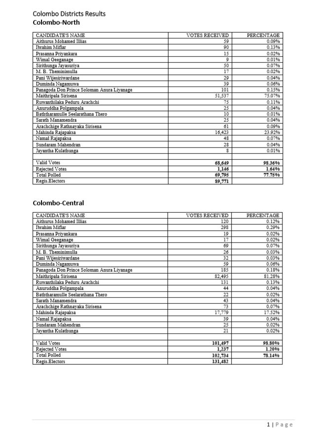
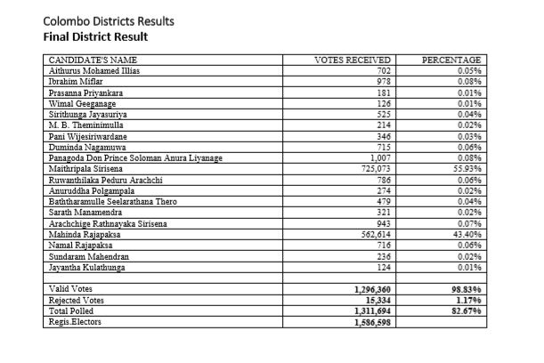

```{r setup, include=FALSE}
knitr::opts_chunk$set(echo = TRUE,warning = FALSE)
library(data.table)
library(stringr)
library(splitstackshape)
library(pdftools)
```

# Structure of Document

Data extraction begins from page 2 of the document. There are two situations,
one is where there are two tables in a page and other is wehre one table in a page.
Each cell has one value, which is votes or percentages depending on the column.

First Column is for Candidates names followed by Valid votes, Rejected votes and
Total polled. Each district begins in a new page. It should be noted that the 
district for respective electorates are mentioned at the top of the page.




# Process of Extraction

Based on number of tables in a page data is extracted. The only input is page number. 
Each district data has been extracted.

```{r Election 2015}
# load the pdf file
SL_PE_2015<-pdf_text("PresidentialElections2015.pdf")

# source the function
source("Extract2015.R")

# all pages----
pages<-c(1:111)

# pages with only one table are excluded----
pages<-pages[-c(1,10,18,31,48,58,61,64,70,82,87,90,96,99,110,111)]

# creating an empty data list----
Election2015<-NULL

# using iterative method to fill this list with above selected pages----
for (i in pages) 
{
  Election2015[[i]]<-Extract_twotable(i)        
}

# pages with only one table----
pages<-c(10,18,31,48,58,61,64,70,82,87,90,96,99,110)

# using iterative method to fill this list with above selected pages----
for (i in pages) 
        {
        Election2015[[i]]<-Extract_onetable(i)        
        }

# The Final of all tables----
Election2015<-do.call("rbind",Election2015)

# Final table of Kaluthara district has a small change in heading and it is rectified
Election2015$Electorate[Election2015$Electorate=="Final District Votes"]<-"Final District Result"
```

# Validating Data extracted 

There is no summary for election results therefore only both way tallying
is compared between the extracted data.

Comparing final tally votes of Mahinda Rajapaksa from the pdf file 
to the data extracted as below. 

```{r Validating Data 1}
# Extracting only Final District District Results of 
# Maithripala Sirisena
# and then adding all the votes 
ElecFinal2015<-subset(Election2015,Electorate=="Final District Result" 
                      & ColNames=="Maithripala Sirisena")
# added votes will be cross checked with the pdf document
ElecFinal2015[,sum(Votes),by="ColNames"]
# Extracting only Final District District Results of 
# Maithripala Sirisena
# and then adding all the votes 
ElecFinal2015<-subset(Election2015,Electorate!="Final District Result" 
                      & ColNames=="Maithripala Sirisena")
# added votes will be cross checked with the pdf document
ElecFinal2015[,sum(Votes),by="ColNames"]
```

It seems data extraction is successful.

Similarly comparing final tally votes of Mahinda Rajapaksa  
from the pdf file to the data extracted as below. 

```{r Validating Data 2}
# Extracting only Final District District Results of 
# Mahinda Rajapaksa
# and then adding all the votes 
ElecFinal2015<-subset(Election2015,Electorate=="Final District Result" 
                      & ColNames=="Mahinda Rajapaksa")
# added votes will be cross checked with the pdf document
ElecFinal2015[,sum(Votes),by="ColNames"]
# Extracting only Final District District Results of 
# Mahinda Rajapaksa
# and then adding all the votes 
ElecFinal2015<-subset(Election2015,Electorate!="Final District Result" 
                      & ColNames=="Mahinda Rajapaksa")
# added votes will be cross checked with the pdf document
ElecFinal2015[,sum(Votes),by="ColNames"]
```

It seems data extraction is successful.

*THANK YOU*